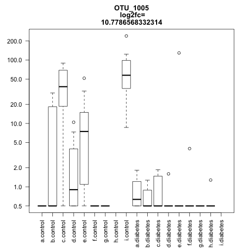

**Master analysis for skin microbiome project**
========================================================


```
## Warning in file(file, "rt"): cannot open file
## 'distances_contra_adj_v_wounds2.csv': No such file or directory
```

```
## Error in file(file, "rt"): cannot open the connection
```
Generate boxplots based on weighted unifrac distances between diabetic adjacent and contrateral skin, and wound swabs and debridement

```
## Warning in is.na(x): is.na() applied to non-(list or vector) of type
## 'closure'
```

```
## Warning in is.na(x): is.na() applied to non-(list or vector) of type
## 'closure'
```

```
## Error in sort.int(x, na.last = na.last, decreasing = decreasing, ...): 'x' must be atomic
```
Test for significant differences between groups

```
## Error in dist$adj_V_ws: object of type 'closure' is not subsettable
```

```
## Error in dist$adj_V_wd: object of type 'closure' is not subsettable
```

```
## Error in dist$adj_V_wd: object of type 'closure' is not subsettable
```

```
## Error in dist$con_V_wd: object of type 'closure' is not subsettable
```
This shows that adjacent diabetic skin is (slightly) more similar to wounds than adjacent diabetic skin, and this difference is significantly different. This justifies the removal of the adjacent diabetic skin samples from the analysis.

Analysis of richness from rarefied OTU table

```
## Warning: replacing previous import by 'ggplot2::Position' when loading
## 'phyloseq'
```

```
## Warning: replacing previous import by 'scales::alpha' when loading
## 'phyloseq'
```

```
## Warning: replacing previous import by 'ggplot2::Position' when loading
## 'DESeq2'
```

```
## Warning: replacing previous import by 'ggplot2::unit' when loading 'Hmisc'
```

```
## Warning: replacing previous import by 'ggplot2::arrow' when loading 'Hmisc'
```

```
## Warning: replacing previous import by 'scales::alpha' when loading 'Hmisc'
```

```
## Warning: package 'ggplot2' was built under R version 3.2.4
```

```
## `set.seed(552)` was used to initialize repeatable random subsampling.
## Please record this for your records so others can reproduce.
## Try `set.seed(552); .Random.seed` for the full vector
## ...
## 561OTUs were removed because they are no longer 
## present in any sample after random subsampling
## 
## ...
```

```
## Warning: Removed 380 rows containing missing values (geom_errorbar).
```

 
Significance testing on alpha diversity results

```r
alpha_estimates<-estimate_richness(rare_mydata_sub, split = TRUE, measures = c("Observed", "Chao1", "Shannon"))
#Sort samples in alpha_estimates by sample name
alpha_estimates_sorted<-alpha_estimates[order(rownames(alpha_estimates)),]
#sort samples in sample_data(rare_mydata_sub) by sample name
sorted_sampledata<-sample_data(rare_mydata_sub)[order(rownames(sample_data(rare_mydata_sub))),]
#Create a vector of which group each sample belongs to from the sampletype1 column and add to alpha estimates file
group<-sorted_sampledata$sampletype1
alpha_estimates_sorted<-cbind(alpha_estimates_sorted, group)
rm(group)
#Sort sorted_alpha_estimates by group
alpha_estimates_sorted<-alpha_estimates_sorted[order(alpha_estimates_sorted$group),]
#Get median, min and max "Observed" values for the three groups under "group"
library(plyr)
median_otus<-ddply(alpha_estimates_sorted, .(group), summarize, median_otus=median(Observed), max=max(Observed), min=min(Observed))
median_otus
```

```
##           group median_otus  max min
## 1  control_skin       789.0 1772 164
## 2 diabetic_skin       314.0 1195  60
## 3         wound        58.5  572  16
```

```r
#Code from Steve Bush to assess statistical difference in diversity between groups.
library(MASS)
fullmodel<-glm.nb(Observed ~factor(group),data=alpha_estimates_sorted)
reducedmodel<- glm.nb (Observed ~1,data=alpha_estimates_sorted)
library(lmtest)
```

```
## Loading required package: zoo
## 
## Attaching package: 'zoo'
## 
## The following objects are masked from 'package:base':
## 
##     as.Date, as.Date.numeric
```

```r
lrtest(fullmodel, reducedmodel)
```

```
## Likelihood ratio test
## 
## Model 1: Observed ~ factor(group)
## Model 2: Observed ~ 1
##   #Df  LogLik Df Chisq Pr(>Chisq)    
## 1   4 -1258.4                        
## 2   2 -1354.8 -2 192.9  < 2.2e-16 ***
## ---
## Signif. codes:  0 '***' 0.001 '**' 0.01 '*' 0.05 '.' 0.1 ' ' 1
```

```r
#Wilcox rank sum test
wilcox.test(Observed ~ group, alpha_estimates_sorted, subset=group%in%c("control_skin", "diabetic_skin"))
```

```
## 
## 	Wilcoxon rank sum test with continuity correction
## 
## data:  Observed by group
## W = 2667.5, p-value = 4.889e-08
## alternative hypothesis: true location shift is not equal to 0
```

```r
wilcox.test(Observed ~ group, alpha_estimates_sorted, subset=group%in%c("wound", "diabetic_skin"))
```

```
## 
## 	Wilcoxon rank sum test with continuity correction
## 
## data:  Observed by group
## W = 2539.5, p-value = 7.913e-13
## alternative hypothesis: true location shift is not equal to 0
```

```r
wilcox.test(Observed ~ group, alpha_estimates_sorted, subset=group%in%c("wound", "control_skin"))
```

```
## 
## 	Wilcoxon rank sum test with continuity correction
## 
## data:  Observed by group
## W = 5431, p-value < 2.2e-16
## alternative hypothesis: true location shift is not equal to 0
```

```r
#Now stats for Chao1 and Shannon
fullmodel<-glm.nb(Chao1 ~factor(group),data=alpha_estimates_sorted)
```

```
## Warning in dpois(y, mu, log = TRUE): non-integer x = 627.388889
```

```
## Warning in dpois(y, mu, log = TRUE): non-integer x = 1042.324675
```

```
## Warning in dpois(y, mu, log = TRUE): non-integer x = 1640.512000
```

```
## Warning in dpois(y, mu, log = TRUE): non-integer x = 1664.842795
```

```
## Warning in dpois(y, mu, log = TRUE): non-integer x = 1620.683258
```

```
## Warning in dpois(y, mu, log = TRUE): non-integer x = 1750.373494
```

```
## Warning in dpois(y, mu, log = TRUE): non-integer x = 864.061538
```

```
## Warning in dpois(y, mu, log = TRUE): non-integer x = 726.441176
```

```
## Warning in dpois(y, mu, log = TRUE): non-integer x = 202.516129
```

```
## Warning in dpois(y, mu, log = TRUE): non-integer x = 1209.664557
```

```
## Warning in dpois(y, mu, log = TRUE): non-integer x = 638.165138
```

```
## Warning in dpois(y, mu, log = TRUE): non-integer x = 1151.864662
```

```
## Warning in dpois(y, mu, log = TRUE): non-integer x = 731.016393
```

```
## Warning in dpois(y, mu, log = TRUE): non-integer x = 702.989130
```

```
## Warning in dpois(y, mu, log = TRUE): non-integer x = 492.144928
```

```
## Warning in dpois(y, mu, log = TRUE): non-integer x = 791.755725
```

```
## Warning in dpois(y, mu, log = TRUE): non-integer x = 1133.564935
```

```
## Warning in dpois(y, mu, log = TRUE): non-integer x = 250.718750
```

```
## Warning in dpois(y, mu, log = TRUE): non-integer x = 289.020000
```

```
## Warning in dpois(y, mu, log = TRUE): non-integer x = 471.621622
```

```
## Warning in dpois(y, mu, log = TRUE): non-integer x = 327.722222
```

```
## Warning in dpois(y, mu, log = TRUE): non-integer x = 1393.505435
```

```
## Warning in dpois(y, mu, log = TRUE): non-integer x = 1171.428571
```

```
## Warning in dpois(y, mu, log = TRUE): non-integer x = 846.583333
```

```
## Warning in dpois(y, mu, log = TRUE): non-integer x = 1206.321637
```

```
## Warning in dpois(y, mu, log = TRUE): non-integer x = 409.373333
```

```
## Warning in dpois(y, mu, log = TRUE): non-integer x = 242.146341
```

```
## Warning in dpois(y, mu, log = TRUE): non-integer x = 381.695652
```

```
## Warning in dpois(y, mu, log = TRUE): non-integer x = 515.651685
```

```
## Warning in dpois(y, mu, log = TRUE): non-integer x = 1410.752632
```

```
## Warning in dpois(y, mu, log = TRUE): non-integer x = 1889.166023
```

```
## Warning in dpois(y, mu, log = TRUE): non-integer x = 1201.492188
```

```
## Warning in dpois(y, mu, log = TRUE): non-integer x = 1019.328000
```

```
## Warning in dpois(y, mu, log = TRUE): non-integer x = 1634.089623
```

```
## Warning in dpois(y, mu, log = TRUE): non-integer x = 944.468750
```

```
## Warning in dpois(y, mu, log = TRUE): non-integer x = 919.570312
```

```
## Warning in dpois(y, mu, log = TRUE): non-integer x = 935.202899
```

```
## Warning in dpois(y, mu, log = TRUE): non-integer x = 773.554545
```

```
## Warning in dpois(y, mu, log = TRUE): non-integer x = 448.800000
```

```
## Warning in dpois(y, mu, log = TRUE): non-integer x = 1862.226562
```

```
## Warning in dpois(y, mu, log = TRUE): non-integer x = 1436.051813
```

```
## Warning in dpois(y, mu, log = TRUE): non-integer x = 918.137931
```

```
## Warning in dpois(y, mu, log = TRUE): non-integer x = 1258.884615
```

```
## Warning in dpois(y, mu, log = TRUE): non-integer x = 1307.152174
```

```
## Warning in dpois(y, mu, log = TRUE): non-integer x = 655.958678
```

```
## Warning in dpois(y, mu, log = TRUE): non-integer x = 1255.733333
```

```
## Warning in dpois(y, mu, log = TRUE): non-integer x = 1107.257353
```

```
## Warning in dpois(y, mu, log = TRUE): non-integer x = 1248.005128
```

```
## Warning in dpois(y, mu, log = TRUE): non-integer x = 427.038462
```

```
## Warning in dpois(y, mu, log = TRUE): non-integer x = 225.105263
```

```
## Warning in dpois(y, mu, log = TRUE): non-integer x = 1326.647668
```

```
## Warning in dpois(y, mu, log = TRUE): non-integer x = 1039.129630
```

```
## Warning in dpois(y, mu, log = TRUE): non-integer x = 782.443182
```

```
## Warning in dpois(y, mu, log = TRUE): non-integer x = 1421.646766
```

```
## Warning in dpois(y, mu, log = TRUE): non-integer x = 1144.326633
```

```
## Warning in dpois(y, mu, log = TRUE): non-integer x = 1086.980132
```

```
## Warning in dpois(y, mu, log = TRUE): non-integer x = 1448.538462
```

```
## Warning in dpois(y, mu, log = TRUE): non-integer x = 912.453988
```

```
## Warning in dpois(y, mu, log = TRUE): non-integer x = 1062.028037
```

```
## Warning in dpois(y, mu, log = TRUE): non-integer x = 671.975904
```

```
## Warning in dpois(y, mu, log = TRUE): non-integer x = 252.312500
```

```
## Warning in dpois(y, mu, log = TRUE): non-integer x = 574.619469
```

```
## Warning in dpois(y, mu, log = TRUE): non-integer x = 872.335878
```

```
## Warning in dpois(y, mu, log = TRUE): non-integer x = 570.250000
```

```
## Warning in dpois(y, mu, log = TRUE): non-integer x = 550.367347
```

```
## Warning in dpois(y, mu, log = TRUE): non-integer x = 902.275000
```

```
## Warning in dpois(y, mu, log = TRUE): non-integer x = 431.493671
```

```
## Warning in dpois(y, mu, log = TRUE): non-integer x = 490.690141
```

```
## Warning in dpois(y, mu, log = TRUE): non-integer x = 1070.636943
```

```
## Warning in dpois(y, mu, log = TRUE): non-integer x = 1085.679775
```

```
## Warning in dpois(y, mu, log = TRUE): non-integer x = 1177.363636
```

```
## Warning in dpois(y, mu, log = TRUE): non-integer x = 2162.291667
```

```
## Warning in dpois(y, mu, log = TRUE): non-integer x = 1486.926829
```

```
## Warning in dpois(y, mu, log = TRUE): non-integer x = 1261.227273
```

```
## Warning in dpois(y, mu, log = TRUE): non-integer x = 1292.778846
```

```
## Warning in dpois(y, mu, log = TRUE): non-integer x = 1105.910615
```

```
## Warning in dpois(y, mu, log = TRUE): non-integer x = 1221.520231
```

```
## Warning in dpois(y, mu, log = TRUE): non-integer x = 946.801370
```

```
## Warning in dpois(y, mu, log = TRUE): non-integer x = 1600.788177
```

```
## Warning in dpois(y, mu, log = TRUE): non-integer x = 1867.283582
```

```
## Warning in dpois(y, mu, log = TRUE): non-integer x = 69.750000
```

```
## Warning in dpois(y, mu, log = TRUE): non-integer x = 1013.082645
```

```
## Warning in dpois(y, mu, log = TRUE): non-integer x = 447.828125
```

```
## Warning in dpois(y, mu, log = TRUE): non-integer x = 558.714286
```

```
## Warning in dpois(y, mu, log = TRUE): non-integer x = 575.235294
```

```
## Warning in dpois(y, mu, log = TRUE): non-integer x = 159.812500
```

```
## Warning in dpois(y, mu, log = TRUE): non-integer x = 226.825000
```

```
## Warning in dpois(y, mu, log = TRUE): non-integer x = 592.968085
```

```
## Warning in dpois(y, mu, log = TRUE): non-integer x = 348.282609
```

```
## Warning in dpois(y, mu, log = TRUE): non-integer x = 394.358209
```

```
## Warning in dpois(y, mu, log = TRUE): non-integer x = 625.011111
```

```
## Warning in dpois(y, mu, log = TRUE): non-integer x = 633.443299
```

```
## Warning in dpois(y, mu, log = TRUE): non-integer x = 1370.420118
```

```
## Warning in dpois(y, mu, log = TRUE): non-integer x = 1371.949686
```

```
## Warning in dpois(y, mu, log = TRUE): non-integer x = 107.750000
```

```
## Warning in dpois(y, mu, log = TRUE): non-integer x = 738.563830
```

```
## Warning in dpois(y, mu, log = TRUE): non-integer x = 408.055556
```

```
## Warning in dpois(y, mu, log = TRUE): non-integer x = 587.280000
```

```
## Warning in dpois(y, mu, log = TRUE): non-integer x = 996.178571
```

```
## Warning in dpois(y, mu, log = TRUE): non-integer x = 1170.839506
```

```
## Warning in dpois(y, mu, log = TRUE): non-integer x = 720.800000
```

```
## Warning in dpois(y, mu, log = TRUE): non-integer x = 256.937500
```

```
## Warning in dpois(y, mu, log = TRUE): non-integer x = 403.923077
```

```
## Warning in dpois(y, mu, log = TRUE): non-integer x = 932.714286
```

```
## Warning in dpois(y, mu, log = TRUE): non-integer x = 198.228571
```

```
## Warning in dpois(y, mu, log = TRUE): non-integer x = 281.129032
```

```
## Warning in dpois(y, mu, log = TRUE): non-integer x = 195.125000
```

```
## Warning in dpois(y, mu, log = TRUE): non-integer x = 215.964286
```

```
## Warning in dpois(y, mu, log = TRUE): non-integer x = 759.453608
```

```
## Warning in dpois(y, mu, log = TRUE): non-integer x = 229.222222
```

```
## Warning in dpois(y, mu, log = TRUE): non-integer x = 543.281690
```

```
## Warning in dpois(y, mu, log = TRUE): non-integer x = 531.114286
```

```
## Warning in dpois(y, mu, log = TRUE): non-integer x = 122.913043
```

```
## Warning in dpois(y, mu, log = TRUE): non-integer x = 358.887097
```

```
## Warning in dpois(y, mu, log = TRUE): non-integer x = 222.418605
```

```
## Warning in dpois(y, mu, log = TRUE): non-integer x = 155.115385
```

```
## Warning in dpois(y, mu, log = TRUE): non-integer x = 180.040000
```

```
## Warning in dpois(y, mu, log = TRUE): non-integer x = 75.545455
```

```
## Warning in dpois(y, mu, log = TRUE): non-integer x = 65.666667
```

```
## Warning in dpois(y, mu, log = TRUE): non-integer x = 42.153846
```

```
## Warning in dpois(y, mu, log = TRUE): non-integer x = 39.500000
```

```
## Warning in dpois(y, mu, log = TRUE): non-integer x = 35.875000
```

```
## Warning in dpois(y, mu, log = TRUE): non-integer x = 31.500000
```

```
## Warning in dpois(y, mu, log = TRUE): non-integer x = 520.141509
```

```
## Warning in dpois(y, mu, log = TRUE): non-integer x = 159.451613
```

```
## Warning in dpois(y, mu, log = TRUE): non-integer x = 42.750000
```

```
## Warning in dpois(y, mu, log = TRUE): non-integer x = 32.857143
```

```
## Warning in dpois(y, mu, log = TRUE): non-integer x = 40.500000
```

```
## Warning in dpois(y, mu, log = TRUE): non-integer x = 575.774194
```

```
## Warning in dpois(y, mu, log = TRUE): non-integer x = 53.142857
```

```
## Warning in dpois(y, mu, log = TRUE): non-integer x = 71.100000
```

```
## Warning in dpois(y, mu, log = TRUE): non-integer x = 30.750000
```

```
## Warning in dpois(y, mu, log = TRUE): non-integer x = 100.652174
```

```
## Warning in dpois(y, mu, log = TRUE): non-integer x = 43.750000
```

```
## Warning in dpois(y, mu, log = TRUE): non-integer x = 135.285714
```

```
## Warning in dpois(y, mu, log = TRUE): non-integer x = 68.111111
```

```
## Warning in dpois(y, mu, log = TRUE): non-integer x = 313.448980
```

```
## Warning in dpois(y, mu, log = TRUE): non-integer x = 216.687500
```

```
## Warning in dpois(y, mu, log = TRUE): non-integer x = 219.937500
```

```
## Warning in dpois(y, mu, log = TRUE): non-integer x = 104.600000
```

```
## Warning in dpois(y, mu, log = TRUE): non-integer x = 97.142857
```

```
## Warning in dpois(y, mu, log = TRUE): non-integer x = 109.272727
```

```
## Warning in dpois(y, mu, log = TRUE): non-integer x = 58.250000
```

```
## Warning in dpois(y, mu, log = TRUE): non-integer x = 203.440000
```

```
## Warning in dpois(y, mu, log = TRUE): non-integer x = 242.275000
```

```
## Warning in dpois(y, mu, log = TRUE): non-integer x = 227.666667
```

```
## Warning in dpois(y, mu, log = TRUE): non-integer x = 827.122951
```

```
## Warning in dpois(y, mu, log = TRUE): non-integer x = 40.142857
```

```
## Warning in dpois(y, mu, log = TRUE): non-integer x = 41.625000
```

```
## Warning in dpois(y, mu, log = TRUE): non-integer x = 93.333333
```

```
## Warning in dpois(y, mu, log = TRUE): non-integer x = 35.500000
```

```
## Warning in dpois(y, mu, log = TRUE): non-integer x = 45.250000
```

```
## Warning in dpois(y, mu, log = TRUE): non-integer x = 236.125000
```

```
## Warning in dpois(y, mu, log = TRUE): non-integer x = 117.200000
```

```
## Warning in dpois(y, mu, log = TRUE): non-integer x = 140.954545
```

```
## Warning in dpois(y, mu, log = TRUE): non-integer x = 118.363636
```

```
## Warning in dpois(y, mu, log = TRUE): non-integer x = 26.500000
```

```
## Warning in dpois(y, mu, log = TRUE): non-integer x = 19.500000
```

```
## Warning in dpois(y, mu, log = TRUE): non-integer x = 33.500000
```

```
## Warning in dpois(y, mu, log = TRUE): non-integer x = 66.153846
```

```
## Warning in dpois(y, mu, log = TRUE): non-integer x = 62.250000
```

```
## Warning in dpois(y, mu, log = TRUE): non-integer x = 69.583333
```

```
## Warning in dpois(y, mu, log = TRUE): non-integer x = 99.076923
```

```
## Warning in dpois(y, mu, log = TRUE): non-integer x = 24.500000
```

```
## Warning in dpois(y, mu, log = TRUE): non-integer x = 217.027778
```

```
## Warning in dpois(y, mu, log = TRUE): non-integer x = 24.666667
```

```
## Warning in dpois(y, mu, log = TRUE): non-integer x = 60.363636
```

```r
reducedmodel<- glm.nb (Chao1 ~1,data=alpha_estimates_sorted)
```

```
## Warning in dpois(y, mu, log = TRUE): non-integer x = 627.388889
```

```
## Warning in dpois(y, mu, log = TRUE): non-integer x = 1042.324675
```

```
## Warning in dpois(y, mu, log = TRUE): non-integer x = 1640.512000
```

```
## Warning in dpois(y, mu, log = TRUE): non-integer x = 1664.842795
```

```
## Warning in dpois(y, mu, log = TRUE): non-integer x = 1620.683258
```

```
## Warning in dpois(y, mu, log = TRUE): non-integer x = 1750.373494
```

```
## Warning in dpois(y, mu, log = TRUE): non-integer x = 864.061538
```

```
## Warning in dpois(y, mu, log = TRUE): non-integer x = 726.441176
```

```
## Warning in dpois(y, mu, log = TRUE): non-integer x = 202.516129
```

```
## Warning in dpois(y, mu, log = TRUE): non-integer x = 1209.664557
```

```
## Warning in dpois(y, mu, log = TRUE): non-integer x = 638.165138
```

```
## Warning in dpois(y, mu, log = TRUE): non-integer x = 1151.864662
```

```
## Warning in dpois(y, mu, log = TRUE): non-integer x = 731.016393
```

```
## Warning in dpois(y, mu, log = TRUE): non-integer x = 702.989130
```

```
## Warning in dpois(y, mu, log = TRUE): non-integer x = 492.144928
```

```
## Warning in dpois(y, mu, log = TRUE): non-integer x = 791.755725
```

```
## Warning in dpois(y, mu, log = TRUE): non-integer x = 1133.564935
```

```
## Warning in dpois(y, mu, log = TRUE): non-integer x = 250.718750
```

```
## Warning in dpois(y, mu, log = TRUE): non-integer x = 289.020000
```

```
## Warning in dpois(y, mu, log = TRUE): non-integer x = 471.621622
```

```
## Warning in dpois(y, mu, log = TRUE): non-integer x = 327.722222
```

```
## Warning in dpois(y, mu, log = TRUE): non-integer x = 1393.505435
```

```
## Warning in dpois(y, mu, log = TRUE): non-integer x = 1171.428571
```

```
## Warning in dpois(y, mu, log = TRUE): non-integer x = 846.583333
```

```
## Warning in dpois(y, mu, log = TRUE): non-integer x = 1206.321637
```

```
## Warning in dpois(y, mu, log = TRUE): non-integer x = 409.373333
```

```
## Warning in dpois(y, mu, log = TRUE): non-integer x = 242.146341
```

```
## Warning in dpois(y, mu, log = TRUE): non-integer x = 381.695652
```

```
## Warning in dpois(y, mu, log = TRUE): non-integer x = 515.651685
```

```
## Warning in dpois(y, mu, log = TRUE): non-integer x = 1410.752632
```

```
## Warning in dpois(y, mu, log = TRUE): non-integer x = 1889.166023
```

```
## Warning in dpois(y, mu, log = TRUE): non-integer x = 1201.492188
```

```
## Warning in dpois(y, mu, log = TRUE): non-integer x = 1019.328000
```

```
## Warning in dpois(y, mu, log = TRUE): non-integer x = 1634.089623
```

```
## Warning in dpois(y, mu, log = TRUE): non-integer x = 944.468750
```

```
## Warning in dpois(y, mu, log = TRUE): non-integer x = 919.570312
```

```
## Warning in dpois(y, mu, log = TRUE): non-integer x = 935.202899
```

```
## Warning in dpois(y, mu, log = TRUE): non-integer x = 773.554545
```

```
## Warning in dpois(y, mu, log = TRUE): non-integer x = 448.800000
```

```
## Warning in dpois(y, mu, log = TRUE): non-integer x = 1862.226562
```

```
## Warning in dpois(y, mu, log = TRUE): non-integer x = 1436.051813
```

```
## Warning in dpois(y, mu, log = TRUE): non-integer x = 918.137931
```

```
## Warning in dpois(y, mu, log = TRUE): non-integer x = 1258.884615
```

```
## Warning in dpois(y, mu, log = TRUE): non-integer x = 1307.152174
```

```
## Warning in dpois(y, mu, log = TRUE): non-integer x = 655.958678
```

```
## Warning in dpois(y, mu, log = TRUE): non-integer x = 1255.733333
```

```
## Warning in dpois(y, mu, log = TRUE): non-integer x = 1107.257353
```

```
## Warning in dpois(y, mu, log = TRUE): non-integer x = 1248.005128
```

```
## Warning in dpois(y, mu, log = TRUE): non-integer x = 427.038462
```

```
## Warning in dpois(y, mu, log = TRUE): non-integer x = 225.105263
```

```
## Warning in dpois(y, mu, log = TRUE): non-integer x = 1326.647668
```

```
## Warning in dpois(y, mu, log = TRUE): non-integer x = 1039.129630
```

```
## Warning in dpois(y, mu, log = TRUE): non-integer x = 782.443182
```

```
## Warning in dpois(y, mu, log = TRUE): non-integer x = 1421.646766
```

```
## Warning in dpois(y, mu, log = TRUE): non-integer x = 1144.326633
```

```
## Warning in dpois(y, mu, log = TRUE): non-integer x = 1086.980132
```

```
## Warning in dpois(y, mu, log = TRUE): non-integer x = 1448.538462
```

```
## Warning in dpois(y, mu, log = TRUE): non-integer x = 912.453988
```

```
## Warning in dpois(y, mu, log = TRUE): non-integer x = 1062.028037
```

```
## Warning in dpois(y, mu, log = TRUE): non-integer x = 671.975904
```

```
## Warning in dpois(y, mu, log = TRUE): non-integer x = 252.312500
```

```
## Warning in dpois(y, mu, log = TRUE): non-integer x = 574.619469
```

```
## Warning in dpois(y, mu, log = TRUE): non-integer x = 872.335878
```

```
## Warning in dpois(y, mu, log = TRUE): non-integer x = 570.250000
```

```
## Warning in dpois(y, mu, log = TRUE): non-integer x = 550.367347
```

```
## Warning in dpois(y, mu, log = TRUE): non-integer x = 902.275000
```

```
## Warning in dpois(y, mu, log = TRUE): non-integer x = 431.493671
```

```
## Warning in dpois(y, mu, log = TRUE): non-integer x = 490.690141
```

```
## Warning in dpois(y, mu, log = TRUE): non-integer x = 1070.636943
```

```
## Warning in dpois(y, mu, log = TRUE): non-integer x = 1085.679775
```

```
## Warning in dpois(y, mu, log = TRUE): non-integer x = 1177.363636
```

```
## Warning in dpois(y, mu, log = TRUE): non-integer x = 2162.291667
```

```
## Warning in dpois(y, mu, log = TRUE): non-integer x = 1486.926829
```

```
## Warning in dpois(y, mu, log = TRUE): non-integer x = 1261.227273
```

```
## Warning in dpois(y, mu, log = TRUE): non-integer x = 1292.778846
```

```
## Warning in dpois(y, mu, log = TRUE): non-integer x = 1105.910615
```

```
## Warning in dpois(y, mu, log = TRUE): non-integer x = 1221.520231
```

```
## Warning in dpois(y, mu, log = TRUE): non-integer x = 946.801370
```

```
## Warning in dpois(y, mu, log = TRUE): non-integer x = 1600.788177
```

```
## Warning in dpois(y, mu, log = TRUE): non-integer x = 1867.283582
```

```
## Warning in dpois(y, mu, log = TRUE): non-integer x = 69.750000
```

```
## Warning in dpois(y, mu, log = TRUE): non-integer x = 1013.082645
```

```
## Warning in dpois(y, mu, log = TRUE): non-integer x = 447.828125
```

```
## Warning in dpois(y, mu, log = TRUE): non-integer x = 558.714286
```

```
## Warning in dpois(y, mu, log = TRUE): non-integer x = 575.235294
```

```
## Warning in dpois(y, mu, log = TRUE): non-integer x = 159.812500
```

```
## Warning in dpois(y, mu, log = TRUE): non-integer x = 226.825000
```

```
## Warning in dpois(y, mu, log = TRUE): non-integer x = 592.968085
```

```
## Warning in dpois(y, mu, log = TRUE): non-integer x = 348.282609
```

```
## Warning in dpois(y, mu, log = TRUE): non-integer x = 394.358209
```

```
## Warning in dpois(y, mu, log = TRUE): non-integer x = 625.011111
```

```
## Warning in dpois(y, mu, log = TRUE): non-integer x = 633.443299
```

```
## Warning in dpois(y, mu, log = TRUE): non-integer x = 1370.420118
```

```
## Warning in dpois(y, mu, log = TRUE): non-integer x = 1371.949686
```

```
## Warning in dpois(y, mu, log = TRUE): non-integer x = 107.750000
```

```
## Warning in dpois(y, mu, log = TRUE): non-integer x = 738.563830
```

```
## Warning in dpois(y, mu, log = TRUE): non-integer x = 408.055556
```

```
## Warning in dpois(y, mu, log = TRUE): non-integer x = 587.280000
```

```
## Warning in dpois(y, mu, log = TRUE): non-integer x = 996.178571
```

```
## Warning in dpois(y, mu, log = TRUE): non-integer x = 1170.839506
```

```
## Warning in dpois(y, mu, log = TRUE): non-integer x = 720.800000
```

```
## Warning in dpois(y, mu, log = TRUE): non-integer x = 256.937500
```

```
## Warning in dpois(y, mu, log = TRUE): non-integer x = 403.923077
```

```
## Warning in dpois(y, mu, log = TRUE): non-integer x = 932.714286
```

```
## Warning in dpois(y, mu, log = TRUE): non-integer x = 198.228571
```

```
## Warning in dpois(y, mu, log = TRUE): non-integer x = 281.129032
```

```
## Warning in dpois(y, mu, log = TRUE): non-integer x = 195.125000
```

```
## Warning in dpois(y, mu, log = TRUE): non-integer x = 215.964286
```

```
## Warning in dpois(y, mu, log = TRUE): non-integer x = 759.453608
```

```
## Warning in dpois(y, mu, log = TRUE): non-integer x = 229.222222
```

```
## Warning in dpois(y, mu, log = TRUE): non-integer x = 543.281690
```

```
## Warning in dpois(y, mu, log = TRUE): non-integer x = 531.114286
```

```
## Warning in dpois(y, mu, log = TRUE): non-integer x = 122.913043
```

```
## Warning in dpois(y, mu, log = TRUE): non-integer x = 358.887097
```

```
## Warning in dpois(y, mu, log = TRUE): non-integer x = 222.418605
```

```
## Warning in dpois(y, mu, log = TRUE): non-integer x = 155.115385
```

```
## Warning in dpois(y, mu, log = TRUE): non-integer x = 180.040000
```

```
## Warning in dpois(y, mu, log = TRUE): non-integer x = 75.545455
```

```
## Warning in dpois(y, mu, log = TRUE): non-integer x = 65.666667
```

```
## Warning in dpois(y, mu, log = TRUE): non-integer x = 42.153846
```

```
## Warning in dpois(y, mu, log = TRUE): non-integer x = 39.500000
```

```
## Warning in dpois(y, mu, log = TRUE): non-integer x = 35.875000
```

```
## Warning in dpois(y, mu, log = TRUE): non-integer x = 31.500000
```

```
## Warning in dpois(y, mu, log = TRUE): non-integer x = 520.141509
```

```
## Warning in dpois(y, mu, log = TRUE): non-integer x = 159.451613
```

```
## Warning in dpois(y, mu, log = TRUE): non-integer x = 42.750000
```

```
## Warning in dpois(y, mu, log = TRUE): non-integer x = 32.857143
```

```
## Warning in dpois(y, mu, log = TRUE): non-integer x = 40.500000
```

```
## Warning in dpois(y, mu, log = TRUE): non-integer x = 575.774194
```

```
## Warning in dpois(y, mu, log = TRUE): non-integer x = 53.142857
```

```
## Warning in dpois(y, mu, log = TRUE): non-integer x = 71.100000
```

```
## Warning in dpois(y, mu, log = TRUE): non-integer x = 30.750000
```

```
## Warning in dpois(y, mu, log = TRUE): non-integer x = 100.652174
```

```
## Warning in dpois(y, mu, log = TRUE): non-integer x = 43.750000
```

```
## Warning in dpois(y, mu, log = TRUE): non-integer x = 135.285714
```

```
## Warning in dpois(y, mu, log = TRUE): non-integer x = 68.111111
```

```
## Warning in dpois(y, mu, log = TRUE): non-integer x = 313.448980
```

```
## Warning in dpois(y, mu, log = TRUE): non-integer x = 216.687500
```

```
## Warning in dpois(y, mu, log = TRUE): non-integer x = 219.937500
```

```
## Warning in dpois(y, mu, log = TRUE): non-integer x = 104.600000
```

```
## Warning in dpois(y, mu, log = TRUE): non-integer x = 97.142857
```

```
## Warning in dpois(y, mu, log = TRUE): non-integer x = 109.272727
```

```
## Warning in dpois(y, mu, log = TRUE): non-integer x = 58.250000
```

```
## Warning in dpois(y, mu, log = TRUE): non-integer x = 203.440000
```

```
## Warning in dpois(y, mu, log = TRUE): non-integer x = 242.275000
```

```
## Warning in dpois(y, mu, log = TRUE): non-integer x = 227.666667
```

```
## Warning in dpois(y, mu, log = TRUE): non-integer x = 827.122951
```

```
## Warning in dpois(y, mu, log = TRUE): non-integer x = 40.142857
```

```
## Warning in dpois(y, mu, log = TRUE): non-integer x = 41.625000
```

```
## Warning in dpois(y, mu, log = TRUE): non-integer x = 93.333333
```

```
## Warning in dpois(y, mu, log = TRUE): non-integer x = 35.500000
```

```
## Warning in dpois(y, mu, log = TRUE): non-integer x = 45.250000
```

```
## Warning in dpois(y, mu, log = TRUE): non-integer x = 236.125000
```

```
## Warning in dpois(y, mu, log = TRUE): non-integer x = 117.200000
```

```
## Warning in dpois(y, mu, log = TRUE): non-integer x = 140.954545
```

```
## Warning in dpois(y, mu, log = TRUE): non-integer x = 118.363636
```

```
## Warning in dpois(y, mu, log = TRUE): non-integer x = 26.500000
```

```
## Warning in dpois(y, mu, log = TRUE): non-integer x = 19.500000
```

```
## Warning in dpois(y, mu, log = TRUE): non-integer x = 33.500000
```

```
## Warning in dpois(y, mu, log = TRUE): non-integer x = 66.153846
```

```
## Warning in dpois(y, mu, log = TRUE): non-integer x = 62.250000
```

```
## Warning in dpois(y, mu, log = TRUE): non-integer x = 69.583333
```

```
## Warning in dpois(y, mu, log = TRUE): non-integer x = 99.076923
```

```
## Warning in dpois(y, mu, log = TRUE): non-integer x = 24.500000
```

```
## Warning in dpois(y, mu, log = TRUE): non-integer x = 217.027778
```

```
## Warning in dpois(y, mu, log = TRUE): non-integer x = 24.666667
```

```
## Warning in dpois(y, mu, log = TRUE): non-integer x = 60.363636
```

```r
lrtest(fullmodel, reducedmodel)
```

```
## Likelihood ratio test
## 
## Model 1: Chao1 ~ factor(group)
## Model 2: Chao1 ~ 1
##   #Df  LogLik Df  Chisq Pr(>Chisq)    
## 1   4 -1300.4                         
## 2   2 -1394.7 -2 188.69  < 2.2e-16 ***
## ---
## Signif. codes:  0 '***' 0.001 '**' 0.01 '*' 0.05 '.' 0.1 ' ' 1
```

```r
wilcox.test(Chao1 ~ group, alpha_estimates_sorted, subset=group%in%c("control_skin", "diabetic_skin"))
```

```
## 
## 	Wilcoxon rank sum test with continuity correction
## 
## data:  Chao1 by group
## W = 2727, p-value = 7.569e-09
## alternative hypothesis: true location shift is not equal to 0
```

```r
wilcox.test(Chao1 ~ group, alpha_estimates_sorted, subset=group%in%c("wound", "diabetic_skin"))
```

```
## 
## 	Wilcoxon rank sum test with continuity correction
## 
## data:  Chao1 by group
## W = 2534, p-value = 1.019e-12
## alternative hypothesis: true location shift is not equal to 0
```

```r
wilcox.test(Chao1 ~ group, alpha_estimates_sorted, subset=group%in%c("wound", "control_skin"))
```

```
## 
## 	Wilcoxon rank sum test with continuity correction
## 
## data:  Chao1 by group
## W = 5424, p-value < 2.2e-16
## alternative hypothesis: true location shift is not equal to 0
```

```r
fullmodel<-glm.nb(Shannon ~factor(group),data=alpha_estimates_sorted)
```

```
## Warning in dpois(y, mu, log = TRUE): non-integer x = 2.327248
```

```
## Warning in dpois(y, mu, log = TRUE): non-integer x = 2.412699
```

```
## Warning in dpois(y, mu, log = TRUE): non-integer x = 3.550557
```

```
## Warning in dpois(y, mu, log = TRUE): non-integer x = 3.591663
```

```
## Warning in dpois(y, mu, log = TRUE): non-integer x = 3.833286
```

```
## Warning in dpois(y, mu, log = TRUE): non-integer x = 3.933719
```

```
## Warning in dpois(y, mu, log = TRUE): non-integer x = 2.184542
```

```
## Warning in dpois(y, mu, log = TRUE): non-integer x = 1.844469
```

```
## Warning in dpois(y, mu, log = TRUE): non-integer x = 0.906475
```

```
## Warning in dpois(y, mu, log = TRUE): non-integer x = 3.711363
```

```
## Warning in dpois(y, mu, log = TRUE): non-integer x = 2.014554
```

```
## Warning in dpois(y, mu, log = TRUE): non-integer x = 4.074728
```

```
## Warning in dpois(y, mu, log = TRUE): non-integer x = 2.960154
```

```
## Warning in dpois(y, mu, log = TRUE): non-integer x = 2.022554
```

```
## Warning in dpois(y, mu, log = TRUE): non-integer x = 2.253411
```

```
## Warning in dpois(y, mu, log = TRUE): non-integer x = 2.005742
```

```
## Warning in dpois(y, mu, log = TRUE): non-integer x = 2.893379
```

```
## Warning in dpois(y, mu, log = TRUE): non-integer x = 1.250004
```

```
## Warning in dpois(y, mu, log = TRUE): non-integer x = 1.518728
```

```
## Warning in dpois(y, mu, log = TRUE): non-integer x = 2.003707
```

```
## Warning in dpois(y, mu, log = TRUE): non-integer x = 2.599921
```

```
## Warning in dpois(y, mu, log = TRUE): non-integer x = 4.028682
```

```
## Warning in dpois(y, mu, log = TRUE): non-integer x = 1.344840
```

```
## Warning in dpois(y, mu, log = TRUE): non-integer x = 1.298005
```

```
## Warning in dpois(y, mu, log = TRUE): non-integer x = 2.743274
```

```
## Warning in dpois(y, mu, log = TRUE): non-integer x = 0.988368
```

```
## Warning in dpois(y, mu, log = TRUE): non-integer x = 0.345324
```

```
## Warning in dpois(y, mu, log = TRUE): non-integer x = 0.398818
```

```
## Warning in dpois(y, mu, log = TRUE): non-integer x = 0.625813
```

```
## Warning in dpois(y, mu, log = TRUE): non-integer x = 4.913529
```

```
## Warning in dpois(y, mu, log = TRUE): non-integer x = 4.176698
```

```
## Warning in dpois(y, mu, log = TRUE): non-integer x = 4.499126
```

```
## Warning in dpois(y, mu, log = TRUE): non-integer x = 2.984053
```

```
## Warning in dpois(y, mu, log = TRUE): non-integer x = 4.370097
```

```
## Warning in dpois(y, mu, log = TRUE): non-integer x = 2.876201
```

```
## Warning in dpois(y, mu, log = TRUE): non-integer x = 2.961193
```

```
## Warning in dpois(y, mu, log = TRUE): non-integer x = 2.095257
```

```
## Warning in dpois(y, mu, log = TRUE): non-integer x = 1.758812
```

```
## Warning in dpois(y, mu, log = TRUE): non-integer x = 1.226055
```

```
## Warning in dpois(y, mu, log = TRUE): non-integer x = 5.154006
```

```
## Warning in dpois(y, mu, log = TRUE): non-integer x = 5.212039
```

```
## Warning in dpois(y, mu, log = TRUE): non-integer x = 3.209805
```

```
## Warning in dpois(y, mu, log = TRUE): non-integer x = 3.408837
```

```
## Warning in dpois(y, mu, log = TRUE): non-integer x = 4.469304
```

```
## Warning in dpois(y, mu, log = TRUE): non-integer x = 4.740870
```

```
## Warning in dpois(y, mu, log = TRUE): non-integer x = 0.754600
```

```
## Warning in dpois(y, mu, log = TRUE): non-integer x = 1.338016
```

```
## Warning in dpois(y, mu, log = TRUE): non-integer x = 3.257144
```

```
## Warning in dpois(y, mu, log = TRUE): non-integer x = 2.958714
```

```
## Warning in dpois(y, mu, log = TRUE): non-integer x = 1.426981
```

```
## Warning in dpois(y, mu, log = TRUE): non-integer x = 2.077929
```

```
## Warning in dpois(y, mu, log = TRUE): non-integer x = 2.954629
```

```
## Warning in dpois(y, mu, log = TRUE): non-integer x = 1.708325
```

```
## Warning in dpois(y, mu, log = TRUE): non-integer x = 2.701376
```

```
## Warning in dpois(y, mu, log = TRUE): non-integer x = 3.238130
```

```
## Warning in dpois(y, mu, log = TRUE): non-integer x = 2.537077
```

```
## Warning in dpois(y, mu, log = TRUE): non-integer x = 2.392907
```

```
## Warning in dpois(y, mu, log = TRUE): non-integer x = 4.335665
```

```
## Warning in dpois(y, mu, log = TRUE): non-integer x = 1.625048
```

```
## Warning in dpois(y, mu, log = TRUE): non-integer x = 4.519600
```

```
## Warning in dpois(y, mu, log = TRUE): non-integer x = 0.875535
```

```
## Warning in dpois(y, mu, log = TRUE): non-integer x = 1.155320
```

```
## Warning in dpois(y, mu, log = TRUE): non-integer x = 1.362730
```

```
## Warning in dpois(y, mu, log = TRUE): non-integer x = 2.483152
```

```
## Warning in dpois(y, mu, log = TRUE): non-integer x = 0.473477
```

```
## Warning in dpois(y, mu, log = TRUE): non-integer x = 0.836492
```

```
## Warning in dpois(y, mu, log = TRUE): non-integer x = 2.073286
```

```
## Warning in dpois(y, mu, log = TRUE): non-integer x = 1.294802
```

```
## Warning in dpois(y, mu, log = TRUE): non-integer x = 0.578158
```

```
## Warning in dpois(y, mu, log = TRUE): non-integer x = 2.783802
```

```
## Warning in dpois(y, mu, log = TRUE): non-integer x = 2.607434
```

```
## Warning in dpois(y, mu, log = TRUE): non-integer x = 1.465553
```

```
## Warning in dpois(y, mu, log = TRUE): non-integer x = 4.164351
```

```
## Warning in dpois(y, mu, log = TRUE): non-integer x = 2.113514
```

```
## Warning in dpois(y, mu, log = TRUE): non-integer x = 2.045018
```

```
## Warning in dpois(y, mu, log = TRUE): non-integer x = 3.088674
```

```
## Warning in dpois(y, mu, log = TRUE): non-integer x = 2.611875
```

```
## Warning in dpois(y, mu, log = TRUE): non-integer x = 3.286555
```

```
## Warning in dpois(y, mu, log = TRUE): non-integer x = 1.963331
```

```
## Warning in dpois(y, mu, log = TRUE): non-integer x = 5.032565
```

```
## Warning in dpois(y, mu, log = TRUE): non-integer x = 5.674431
```

```
## Warning in dpois(y, mu, log = TRUE): non-integer x = 1.134776
```

```
## Warning in dpois(y, mu, log = TRUE): non-integer x = 3.310662
```

```
## Warning in dpois(y, mu, log = TRUE): non-integer x = 2.687963
```

```
## Warning in dpois(y, mu, log = TRUE): non-integer x = 2.002357
```

```
## Warning in dpois(y, mu, log = TRUE): non-integer x = 2.953343
```

```
## Warning in dpois(y, mu, log = TRUE): non-integer x = 1.978064
```

```
## Warning in dpois(y, mu, log = TRUE): non-integer x = 1.785301
```

```
## Warning in dpois(y, mu, log = TRUE): non-integer x = 1.129863
```

```
## Warning in dpois(y, mu, log = TRUE): non-integer x = 1.500779
```

```
## Warning in dpois(y, mu, log = TRUE): non-integer x = 1.661812
```

```
## Warning in dpois(y, mu, log = TRUE): non-integer x = 1.308996
```

```
## Warning in dpois(y, mu, log = TRUE): non-integer x = 2.882222
```

```
## Warning in dpois(y, mu, log = TRUE): non-integer x = 3.131427
```

```
## Warning in dpois(y, mu, log = TRUE): non-integer x = 4.688734
```

```
## Warning in dpois(y, mu, log = TRUE): non-integer x = 4.134023
```

```
## Warning in dpois(y, mu, log = TRUE): non-integer x = 0.364052
```

```
## Warning in dpois(y, mu, log = TRUE): non-integer x = 0.529072
```

```
## Warning in dpois(y, mu, log = TRUE): non-integer x = 3.772994
```

```
## Warning in dpois(y, mu, log = TRUE): non-integer x = 1.669600
```

```
## Warning in dpois(y, mu, log = TRUE): non-integer x = 3.771782
```

```
## Warning in dpois(y, mu, log = TRUE): non-integer x = 4.394869
```

```
## Warning in dpois(y, mu, log = TRUE): non-integer x = 4.388127
```

```
## Warning in dpois(y, mu, log = TRUE): non-integer x = 3.682559
```

```
## Warning in dpois(y, mu, log = TRUE): non-integer x = 2.767216
```

```
## Warning in dpois(y, mu, log = TRUE): non-integer x = 1.137201
```

```
## Warning in dpois(y, mu, log = TRUE): non-integer x = 2.154250
```

```
## Warning in dpois(y, mu, log = TRUE): non-integer x = 0.260676
```

```
## Warning in dpois(y, mu, log = TRUE): non-integer x = 2.493192
```

```
## Warning in dpois(y, mu, log = TRUE): non-integer x = 2.103429
```

```
## Warning in dpois(y, mu, log = TRUE): non-integer x = 0.515173
```

```
## Warning in dpois(y, mu, log = TRUE): non-integer x = 0.559661
```

```
## Warning in dpois(y, mu, log = TRUE): non-integer x = 3.296314
```

```
## Warning in dpois(y, mu, log = TRUE): non-integer x = 1.151320
```

```
## Warning in dpois(y, mu, log = TRUE): non-integer x = 1.244649
```

```
## Warning in dpois(y, mu, log = TRUE): non-integer x = 2.879764
```

```
## Warning in dpois(y, mu, log = TRUE): non-integer x = 1.412323
```

```
## Warning in dpois(y, mu, log = TRUE): non-integer x = 1.052696
```

```
## Warning in dpois(y, mu, log = TRUE): non-integer x = 0.781825
```

```
## Warning in dpois(y, mu, log = TRUE): non-integer x = 1.277064
```

```
## Warning in dpois(y, mu, log = TRUE): non-integer x = 0.882872
```

```
## Warning in dpois(y, mu, log = TRUE): non-integer x = 0.879127
```

```
## Warning in dpois(y, mu, log = TRUE): non-integer x = 0.864326
```

```
## Warning in dpois(y, mu, log = TRUE): non-integer x = 0.653877
```

```
## Warning in dpois(y, mu, log = TRUE): non-integer x = 0.238277
```

```
## Warning in dpois(y, mu, log = TRUE): non-integer x = 0.233527
```

```
## Warning in dpois(y, mu, log = TRUE): non-integer x = 1.074373
```

```
## Warning in dpois(y, mu, log = TRUE): non-integer x = 1.119490
```

```
## Warning in dpois(y, mu, log = TRUE): non-integer x = 1.362369
```

```
## Warning in dpois(y, mu, log = TRUE): non-integer x = 0.946643
```

```
## Warning in dpois(y, mu, log = TRUE): non-integer x = 0.913639
```

```
## Warning in dpois(y, mu, log = TRUE): non-integer x = 0.816972
```

```
## Warning in dpois(y, mu, log = TRUE): non-integer x = 1.065594
```

```
## Warning in dpois(y, mu, log = TRUE): non-integer x = 1.234875
```

```
## Warning in dpois(y, mu, log = TRUE): non-integer x = 0.248659
```

```
## Warning in dpois(y, mu, log = TRUE): non-integer x = 0.277923
```

```
## Warning in dpois(y, mu, log = TRUE): non-integer x = 1.807781
```

```
## Warning in dpois(y, mu, log = TRUE): non-integer x = 0.941318
```

```
## Warning in dpois(y, mu, log = TRUE): non-integer x = 1.553049
```

```
## Warning in dpois(y, mu, log = TRUE): non-integer x = 0.880626
```

```
## Warning in dpois(y, mu, log = TRUE): non-integer x = 0.851499
```

```
## Warning in dpois(y, mu, log = TRUE): non-integer x = 1.164662
```

```
## Warning in dpois(y, mu, log = TRUE): non-integer x = 0.909184
```

```
## Warning in dpois(y, mu, log = TRUE): non-integer x = 1.342511
```

```
## Warning in dpois(y, mu, log = TRUE): non-integer x = 1.888665
```

```
## Warning in dpois(y, mu, log = TRUE): non-integer x = 3.150974
```

```
## Warning in dpois(y, mu, log = TRUE): non-integer x = 1.124577
```

```
## Warning in dpois(y, mu, log = TRUE): non-integer x = 2.830432
```

```
## Warning in dpois(y, mu, log = TRUE): non-integer x = 2.748467
```

```
## Warning in dpois(y, mu, log = TRUE): non-integer x = 2.008508
```

```
## Warning in dpois(y, mu, log = TRUE): non-integer x = 2.838142
```

```
## Warning in dpois(y, mu, log = TRUE): non-integer x = 0.522168
```

```
## Warning in dpois(y, mu, log = TRUE): non-integer x = 1.036580
```

```
## Warning in dpois(y, mu, log = TRUE): non-integer x = 1.224114
```

```
## Warning in dpois(y, mu, log = TRUE): non-integer x = 0.464835
```

```
## Warning in dpois(y, mu, log = TRUE): non-integer x = 1.034419
```

```
## Warning in dpois(y, mu, log = TRUE): non-integer x = 1.434289
```

```
## Warning in dpois(y, mu, log = TRUE): non-integer x = 1.834131
```

```
## Warning in dpois(y, mu, log = TRUE): non-integer x = 0.701920
```

```
## Warning in dpois(y, mu, log = TRUE): non-integer x = 1.724761
```

```
## Warning in dpois(y, mu, log = TRUE): non-integer x = 2.469857
```

```
## Warning in dpois(y, mu, log = TRUE): non-integer x = 1.509575
```

```
## Warning in dpois(y, mu, log = TRUE): non-integer x = 0.993159
```

```
## Warning in dpois(y, mu, log = TRUE): non-integer x = 1.552926
```

```
## Warning in dpois(y, mu, log = TRUE): non-integer x = 1.786664
```

```
## Warning in dpois(y, mu, log = TRUE): non-integer x = 0.472900
```

```
## Warning in dpois(y, mu, log = TRUE): non-integer x = 0.446013
```

```
## Warning in dpois(y, mu, log = TRUE): non-integer x = 1.281283
```

```
## Warning in dpois(y, mu, log = TRUE): non-integer x = 0.983269
```

```
## Warning in dpois(y, mu, log = TRUE): non-integer x = 1.362517
```

```
## Warning in dpois(y, mu, log = TRUE): non-integer x = 0.567496
```

```
## Warning in dpois(y, mu, log = TRUE): non-integer x = 0.335964
```

```
## Warning in dpois(y, mu, log = TRUE): non-integer x = 2.069701
```

```
## Warning in dpois(y, mu, log = TRUE): non-integer x = 0.598248
```

```
## Warning in dpois(y, mu, log = TRUE): non-integer x = 0.396230
```

```
## Warning in dpois(y, mu, log = TRUE): non-integer x = 1.492349
```

```
## Warning in dpois(y, mu, log = TRUE): non-integer x = 1.549978
```

```
## Warning in dpois(y, mu, log = TRUE): non-integer x = 1.739912
```

```
## Warning in dpois(y, mu, log = TRUE): non-integer x = 2.009198
```

```
## Warning in dpois(y, mu, log = TRUE): non-integer x = 1.219024
```

```
## Warning in dpois(y, mu, log = TRUE): non-integer x = 1.235210
```

```
## Warning in dpois(y, mu, log = TRUE): non-integer x = 1.338795
```

```
## Warning in dpois(y, mu, log = TRUE): non-integer x = 1.033163
```

```
## Warning in dpois(y, mu, log = TRUE): non-integer x = 0.276560
```

```
## Warning in dpois(y, mu, log = TRUE): non-integer x = 0.796874
```

```
## Warning in dpois(y, mu, log = TRUE): non-integer x = 0.539174
```

```
## Warning in dpois(y, mu, log = TRUE): non-integer x = 0.754988
```

```
## Warning in dpois(y, mu, log = TRUE): non-integer x = 0.022769
```

```
## Warning in dpois(y, mu, log = TRUE): non-integer x = 0.682099
```

```
## Warning in dpois(y, mu, log = TRUE): non-integer x = 0.661754
```

```
## Warning in theta.ml(Y, mu, sum(w), w, limit = control$maxit, trace =
## control$trace > : iteration limit reached
```

```
## Warning in theta.ml(Y, mu, sum(w), w, limit = control$maxit, trace =
## control$trace > : iteration limit reached
```

```r
reducedmodel<- glm.nb (Shannon ~1,data=alpha_estimates_sorted)
```

```
## Warning in dpois(y, mu, log = TRUE): non-integer x = 2.327248
```

```
## Warning in dpois(y, mu, log = TRUE): non-integer x = 2.412699
```

```
## Warning in dpois(y, mu, log = TRUE): non-integer x = 3.550557
```

```
## Warning in dpois(y, mu, log = TRUE): non-integer x = 3.591663
```

```
## Warning in dpois(y, mu, log = TRUE): non-integer x = 3.833286
```

```
## Warning in dpois(y, mu, log = TRUE): non-integer x = 3.933719
```

```
## Warning in dpois(y, mu, log = TRUE): non-integer x = 2.184542
```

```
## Warning in dpois(y, mu, log = TRUE): non-integer x = 1.844469
```

```
## Warning in dpois(y, mu, log = TRUE): non-integer x = 0.906475
```

```
## Warning in dpois(y, mu, log = TRUE): non-integer x = 3.711363
```

```
## Warning in dpois(y, mu, log = TRUE): non-integer x = 2.014554
```

```
## Warning in dpois(y, mu, log = TRUE): non-integer x = 4.074728
```

```
## Warning in dpois(y, mu, log = TRUE): non-integer x = 2.960154
```

```
## Warning in dpois(y, mu, log = TRUE): non-integer x = 2.022554
```

```
## Warning in dpois(y, mu, log = TRUE): non-integer x = 2.253411
```

```
## Warning in dpois(y, mu, log = TRUE): non-integer x = 2.005742
```

```
## Warning in dpois(y, mu, log = TRUE): non-integer x = 2.893379
```

```
## Warning in dpois(y, mu, log = TRUE): non-integer x = 1.250004
```

```
## Warning in dpois(y, mu, log = TRUE): non-integer x = 1.518728
```

```
## Warning in dpois(y, mu, log = TRUE): non-integer x = 2.003707
```

```
## Warning in dpois(y, mu, log = TRUE): non-integer x = 2.599921
```

```
## Warning in dpois(y, mu, log = TRUE): non-integer x = 4.028682
```

```
## Warning in dpois(y, mu, log = TRUE): non-integer x = 1.344840
```

```
## Warning in dpois(y, mu, log = TRUE): non-integer x = 1.298005
```

```
## Warning in dpois(y, mu, log = TRUE): non-integer x = 2.743274
```

```
## Warning in dpois(y, mu, log = TRUE): non-integer x = 0.988368
```

```
## Warning in dpois(y, mu, log = TRUE): non-integer x = 0.345324
```

```
## Warning in dpois(y, mu, log = TRUE): non-integer x = 0.398818
```

```
## Warning in dpois(y, mu, log = TRUE): non-integer x = 0.625813
```

```
## Warning in dpois(y, mu, log = TRUE): non-integer x = 4.913529
```

```
## Warning in dpois(y, mu, log = TRUE): non-integer x = 4.176698
```

```
## Warning in dpois(y, mu, log = TRUE): non-integer x = 4.499126
```

```
## Warning in dpois(y, mu, log = TRUE): non-integer x = 2.984053
```

```
## Warning in dpois(y, mu, log = TRUE): non-integer x = 4.370097
```

```
## Warning in dpois(y, mu, log = TRUE): non-integer x = 2.876201
```

```
## Warning in dpois(y, mu, log = TRUE): non-integer x = 2.961193
```

```
## Warning in dpois(y, mu, log = TRUE): non-integer x = 2.095257
```

```
## Warning in dpois(y, mu, log = TRUE): non-integer x = 1.758812
```

```
## Warning in dpois(y, mu, log = TRUE): non-integer x = 1.226055
```

```
## Warning in dpois(y, mu, log = TRUE): non-integer x = 5.154006
```

```
## Warning in dpois(y, mu, log = TRUE): non-integer x = 5.212039
```

```
## Warning in dpois(y, mu, log = TRUE): non-integer x = 3.209805
```

```
## Warning in dpois(y, mu, log = TRUE): non-integer x = 3.408837
```

```
## Warning in dpois(y, mu, log = TRUE): non-integer x = 4.469304
```

```
## Warning in dpois(y, mu, log = TRUE): non-integer x = 4.740870
```

```
## Warning in dpois(y, mu, log = TRUE): non-integer x = 0.754600
```

```
## Warning in dpois(y, mu, log = TRUE): non-integer x = 1.338016
```

```
## Warning in dpois(y, mu, log = TRUE): non-integer x = 3.257144
```

```
## Warning in dpois(y, mu, log = TRUE): non-integer x = 2.958714
```

```
## Warning in dpois(y, mu, log = TRUE): non-integer x = 1.426981
```

```
## Warning in dpois(y, mu, log = TRUE): non-integer x = 2.077929
```

```
## Warning in dpois(y, mu, log = TRUE): non-integer x = 2.954629
```

```
## Warning in dpois(y, mu, log = TRUE): non-integer x = 1.708325
```

```
## Warning in dpois(y, mu, log = TRUE): non-integer x = 2.701376
```

```
## Warning in dpois(y, mu, log = TRUE): non-integer x = 3.238130
```

```
## Warning in dpois(y, mu, log = TRUE): non-integer x = 2.537077
```

```
## Warning in dpois(y, mu, log = TRUE): non-integer x = 2.392907
```

```
## Warning in dpois(y, mu, log = TRUE): non-integer x = 4.335665
```

```
## Warning in dpois(y, mu, log = TRUE): non-integer x = 1.625048
```

```
## Warning in dpois(y, mu, log = TRUE): non-integer x = 4.519600
```

```
## Warning in dpois(y, mu, log = TRUE): non-integer x = 0.875535
```

```
## Warning in dpois(y, mu, log = TRUE): non-integer x = 1.155320
```

```
## Warning in dpois(y, mu, log = TRUE): non-integer x = 1.362730
```

```
## Warning in dpois(y, mu, log = TRUE): non-integer x = 2.483152
```

```
## Warning in dpois(y, mu, log = TRUE): non-integer x = 0.473477
```

```
## Warning in dpois(y, mu, log = TRUE): non-integer x = 0.836492
```

```
## Warning in dpois(y, mu, log = TRUE): non-integer x = 2.073286
```

```
## Warning in dpois(y, mu, log = TRUE): non-integer x = 1.294802
```

```
## Warning in dpois(y, mu, log = TRUE): non-integer x = 0.578158
```

```
## Warning in dpois(y, mu, log = TRUE): non-integer x = 2.783802
```

```
## Warning in dpois(y, mu, log = TRUE): non-integer x = 2.607434
```

```
## Warning in dpois(y, mu, log = TRUE): non-integer x = 1.465553
```

```
## Warning in dpois(y, mu, log = TRUE): non-integer x = 4.164351
```

```
## Warning in dpois(y, mu, log = TRUE): non-integer x = 2.113514
```

```
## Warning in dpois(y, mu, log = TRUE): non-integer x = 2.045018
```

```
## Warning in dpois(y, mu, log = TRUE): non-integer x = 3.088674
```

```
## Warning in dpois(y, mu, log = TRUE): non-integer x = 2.611875
```

```
## Warning in dpois(y, mu, log = TRUE): non-integer x = 3.286555
```

```
## Warning in dpois(y, mu, log = TRUE): non-integer x = 1.963331
```

```
## Warning in dpois(y, mu, log = TRUE): non-integer x = 5.032565
```

```
## Warning in dpois(y, mu, log = TRUE): non-integer x = 5.674431
```

```
## Warning in dpois(y, mu, log = TRUE): non-integer x = 1.134776
```

```
## Warning in dpois(y, mu, log = TRUE): non-integer x = 3.310662
```

```
## Warning in dpois(y, mu, log = TRUE): non-integer x = 2.687963
```

```
## Warning in dpois(y, mu, log = TRUE): non-integer x = 2.002357
```

```
## Warning in dpois(y, mu, log = TRUE): non-integer x = 2.953343
```

```
## Warning in dpois(y, mu, log = TRUE): non-integer x = 1.978064
```

```
## Warning in dpois(y, mu, log = TRUE): non-integer x = 1.785301
```

```
## Warning in dpois(y, mu, log = TRUE): non-integer x = 1.129863
```

```
## Warning in dpois(y, mu, log = TRUE): non-integer x = 1.500779
```

```
## Warning in dpois(y, mu, log = TRUE): non-integer x = 1.661812
```

```
## Warning in dpois(y, mu, log = TRUE): non-integer x = 1.308996
```

```
## Warning in dpois(y, mu, log = TRUE): non-integer x = 2.882222
```

```
## Warning in dpois(y, mu, log = TRUE): non-integer x = 3.131427
```

```
## Warning in dpois(y, mu, log = TRUE): non-integer x = 4.688734
```

```
## Warning in dpois(y, mu, log = TRUE): non-integer x = 4.134023
```

```
## Warning in dpois(y, mu, log = TRUE): non-integer x = 0.364052
```

```
## Warning in dpois(y, mu, log = TRUE): non-integer x = 0.529072
```

```
## Warning in dpois(y, mu, log = TRUE): non-integer x = 3.772994
```

```
## Warning in dpois(y, mu, log = TRUE): non-integer x = 1.669600
```

```
## Warning in dpois(y, mu, log = TRUE): non-integer x = 3.771782
```

```
## Warning in dpois(y, mu, log = TRUE): non-integer x = 4.394869
```

```
## Warning in dpois(y, mu, log = TRUE): non-integer x = 4.388127
```

```
## Warning in dpois(y, mu, log = TRUE): non-integer x = 3.682559
```

```
## Warning in dpois(y, mu, log = TRUE): non-integer x = 2.767216
```

```
## Warning in dpois(y, mu, log = TRUE): non-integer x = 1.137201
```

```
## Warning in dpois(y, mu, log = TRUE): non-integer x = 2.154250
```

```
## Warning in dpois(y, mu, log = TRUE): non-integer x = 0.260676
```

```
## Warning in dpois(y, mu, log = TRUE): non-integer x = 2.493192
```

```
## Warning in dpois(y, mu, log = TRUE): non-integer x = 2.103429
```

```
## Warning in dpois(y, mu, log = TRUE): non-integer x = 0.515173
```

```
## Warning in dpois(y, mu, log = TRUE): non-integer x = 0.559661
```

```
## Warning in dpois(y, mu, log = TRUE): non-integer x = 3.296314
```

```
## Warning in dpois(y, mu, log = TRUE): non-integer x = 1.151320
```

```
## Warning in dpois(y, mu, log = TRUE): non-integer x = 1.244649
```

```
## Warning in dpois(y, mu, log = TRUE): non-integer x = 2.879764
```

```
## Warning in dpois(y, mu, log = TRUE): non-integer x = 1.412323
```

```
## Warning in dpois(y, mu, log = TRUE): non-integer x = 1.052696
```

```
## Warning in dpois(y, mu, log = TRUE): non-integer x = 0.781825
```

```
## Warning in dpois(y, mu, log = TRUE): non-integer x = 1.277064
```

```
## Warning in dpois(y, mu, log = TRUE): non-integer x = 0.882872
```

```
## Warning in dpois(y, mu, log = TRUE): non-integer x = 0.879127
```

```
## Warning in dpois(y, mu, log = TRUE): non-integer x = 0.864326
```

```
## Warning in dpois(y, mu, log = TRUE): non-integer x = 0.653877
```

```
## Warning in dpois(y, mu, log = TRUE): non-integer x = 0.238277
```

```
## Warning in dpois(y, mu, log = TRUE): non-integer x = 0.233527
```

```
## Warning in dpois(y, mu, log = TRUE): non-integer x = 1.074373
```

```
## Warning in dpois(y, mu, log = TRUE): non-integer x = 1.119490
```

```
## Warning in dpois(y, mu, log = TRUE): non-integer x = 1.362369
```

```
## Warning in dpois(y, mu, log = TRUE): non-integer x = 0.946643
```

```
## Warning in dpois(y, mu, log = TRUE): non-integer x = 0.913639
```

```
## Warning in dpois(y, mu, log = TRUE): non-integer x = 0.816972
```

```
## Warning in dpois(y, mu, log = TRUE): non-integer x = 1.065594
```

```
## Warning in dpois(y, mu, log = TRUE): non-integer x = 1.234875
```

```
## Warning in dpois(y, mu, log = TRUE): non-integer x = 0.248659
```

```
## Warning in dpois(y, mu, log = TRUE): non-integer x = 0.277923
```

```
## Warning in dpois(y, mu, log = TRUE): non-integer x = 1.807781
```

```
## Warning in dpois(y, mu, log = TRUE): non-integer x = 0.941318
```

```
## Warning in dpois(y, mu, log = TRUE): non-integer x = 1.553049
```

```
## Warning in dpois(y, mu, log = TRUE): non-integer x = 0.880626
```

```
## Warning in dpois(y, mu, log = TRUE): non-integer x = 0.851499
```

```
## Warning in dpois(y, mu, log = TRUE): non-integer x = 1.164662
```

```
## Warning in dpois(y, mu, log = TRUE): non-integer x = 0.909184
```

```
## Warning in dpois(y, mu, log = TRUE): non-integer x = 1.342511
```

```
## Warning in dpois(y, mu, log = TRUE): non-integer x = 1.888665
```

```
## Warning in dpois(y, mu, log = TRUE): non-integer x = 3.150974
```

```
## Warning in dpois(y, mu, log = TRUE): non-integer x = 1.124577
```

```
## Warning in dpois(y, mu, log = TRUE): non-integer x = 2.830432
```

```
## Warning in dpois(y, mu, log = TRUE): non-integer x = 2.748467
```

```
## Warning in dpois(y, mu, log = TRUE): non-integer x = 2.008508
```

```
## Warning in dpois(y, mu, log = TRUE): non-integer x = 2.838142
```

```
## Warning in dpois(y, mu, log = TRUE): non-integer x = 0.522168
```

```
## Warning in dpois(y, mu, log = TRUE): non-integer x = 1.036580
```

```
## Warning in dpois(y, mu, log = TRUE): non-integer x = 1.224114
```

```
## Warning in dpois(y, mu, log = TRUE): non-integer x = 0.464835
```

```
## Warning in dpois(y, mu, log = TRUE): non-integer x = 1.034419
```

```
## Warning in dpois(y, mu, log = TRUE): non-integer x = 1.434289
```

```
## Warning in dpois(y, mu, log = TRUE): non-integer x = 1.834131
```

```
## Warning in dpois(y, mu, log = TRUE): non-integer x = 0.701920
```

```
## Warning in dpois(y, mu, log = TRUE): non-integer x = 1.724761
```

```
## Warning in dpois(y, mu, log = TRUE): non-integer x = 2.469857
```

```
## Warning in dpois(y, mu, log = TRUE): non-integer x = 1.509575
```

```
## Warning in dpois(y, mu, log = TRUE): non-integer x = 0.993159
```

```
## Warning in dpois(y, mu, log = TRUE): non-integer x = 1.552926
```

```
## Warning in dpois(y, mu, log = TRUE): non-integer x = 1.786664
```

```
## Warning in dpois(y, mu, log = TRUE): non-integer x = 0.472900
```

```
## Warning in dpois(y, mu, log = TRUE): non-integer x = 0.446013
```

```
## Warning in dpois(y, mu, log = TRUE): non-integer x = 1.281283
```

```
## Warning in dpois(y, mu, log = TRUE): non-integer x = 0.983269
```

```
## Warning in dpois(y, mu, log = TRUE): non-integer x = 1.362517
```

```
## Warning in dpois(y, mu, log = TRUE): non-integer x = 0.567496
```

```
## Warning in dpois(y, mu, log = TRUE): non-integer x = 0.335964
```

```
## Warning in dpois(y, mu, log = TRUE): non-integer x = 2.069701
```

```
## Warning in dpois(y, mu, log = TRUE): non-integer x = 0.598248
```

```
## Warning in dpois(y, mu, log = TRUE): non-integer x = 0.396230
```

```
## Warning in dpois(y, mu, log = TRUE): non-integer x = 1.492349
```

```
## Warning in dpois(y, mu, log = TRUE): non-integer x = 1.549978
```

```
## Warning in dpois(y, mu, log = TRUE): non-integer x = 1.739912
```

```
## Warning in dpois(y, mu, log = TRUE): non-integer x = 2.009198
```

```
## Warning in dpois(y, mu, log = TRUE): non-integer x = 1.219024
```

```
## Warning in dpois(y, mu, log = TRUE): non-integer x = 1.235210
```

```
## Warning in dpois(y, mu, log = TRUE): non-integer x = 1.338795
```

```
## Warning in dpois(y, mu, log = TRUE): non-integer x = 1.033163
```

```
## Warning in dpois(y, mu, log = TRUE): non-integer x = 0.276560
```

```
## Warning in dpois(y, mu, log = TRUE): non-integer x = 0.796874
```

```
## Warning in dpois(y, mu, log = TRUE): non-integer x = 0.539174
```

```
## Warning in dpois(y, mu, log = TRUE): non-integer x = 0.754988
```

```
## Warning in dpois(y, mu, log = TRUE): non-integer x = 0.022769
```

```
## Warning in dpois(y, mu, log = TRUE): non-integer x = 0.682099
```

```
## Warning in dpois(y, mu, log = TRUE): non-integer x = 0.661754
```

```
## Warning in theta.ml(Y, mu, sum(w), w, limit = control$maxit, trace =
## control$trace > : iteration limit reached
```

```
## Warning in theta.ml(Y, mu, sum(w), w, limit = control$maxit, trace =
## control$trace > : iteration limit reached
```

```r
lrtest(fullmodel, reducedmodel)
```

```
## Likelihood ratio test
## 
## Model 1: Shannon ~ factor(group)
## Model 2: Shannon ~ 1
##   #Df  LogLik Df  Chisq Pr(>Chisq)    
## 1   4 -285.34                         
## 2   2 -305.70 -2 40.737  1.426e-09 ***
## ---
## Signif. codes:  0 '***' 0.001 '**' 0.01 '*' 0.05 '.' 0.1 ' ' 1
```

```r
wilcox.test(Shannon ~ group, alpha_estimates_sorted, subset=group%in%c("control_skin", "diabetic_skin"))
```

```
## 
## 	Wilcoxon rank sum test with continuity correction
## 
## data:  Shannon by group
## W = 2037, p-value = 0.04156
## alternative hypothesis: true location shift is not equal to 0
```

```r
wilcox.test(Shannon ~ group, alpha_estimates_sorted, subset=group%in%c("control_skin", "diabetic_skin"), correct=FALSE)
```

```
## 
## 	Wilcoxon rank sum test
## 
## data:  Shannon by group
## W = 2037, p-value = 0.04129
## alternative hypothesis: true location shift is not equal to 0
```

```r
wilcox.test(Shannon ~ group, alpha_estimates_sorted, subset=group%in%c("wound", "diabetic_skin"))
```

```
## 
## 	Wilcoxon rank sum test with continuity correction
## 
## data:  Shannon by group
## W = 2013, p-value = 0.0001093
## alternative hypothesis: true location shift is not equal to 0
```

```r
wilcox.test(Shannon ~ group, alpha_estimates_sorted, subset=group%in%c("wound", "control_skin"))
```

```
## 
## 	Wilcoxon rank sum test with continuity correction
## 
## data:  Shannon by group
## W = 4576, p-value = 3.869e-12
## alternative hypothesis: true location shift is not equal to 0
```
Plots of top 20 OTUs by average abundance per group.

```r
#Using apply to get average abundances of OTUs per group.  First create vectors of names of each group of samples
control_skin_samples<-rownames(sample_data(rare_mydata_sub)[sample_data(rare_mydata_sub)[,"sampletype1"]=="control_skin"])
diabetic_skin_samples<-rownames(sample_data(rare_mydata_sub)[sample_data(rare_mydata_sub)[,"sampletype1"]=="diabetic_skin"])
wound_swab_samples<-rownames(sample_data(rare_mydata_sub)[sample_data(rare_mydata_sub)[,"sampletype2"]=="wound_swab"])
wound_deb_samples<-rownames(sample_data(rare_mydata_sub)[sample_data(rare_mydata_sub)[,"sampletype2"]=="wound_deb"])
#Now apply the mean function only to columns of the OTU table that correspond to a sample from each of the vectors of groups sample names. i.e. gets mean abundance for each OTU for each of the 4 sample groups defined above.
mean_abund_control_skin_otus<-as.matrix(apply(otu_table(rare_mydata_sub)[,control_skin_samples],1, FUN=mean))
stdev_abund_control_skin_otus<-as.matrix(apply(otu_table(rare_mydata_sub)[,control_skin_samples],1, FUN=sd))
mean_abund_diabetic_skin_otus<-as.matrix(apply(otu_table(rare_mydata_sub)[,diabetic_skin_samples],1, FUN=mean))
stdev_abund_diabetic_skin_otus<-as.matrix(apply(otu_table(rare_mydata_sub)[,diabetic_skin_samples],1, FUN=sd))
mean_abund_wound_swab_otus<-as.matrix(apply(otu_table(rare_mydata_sub)[,wound_swab_samples],1, FUN=mean))
mean_abund_wound_deb_otus<-as.matrix(apply(otu_table(rare_mydata_sub)[,wound_deb_samples],1, FUN=mean))
#Now bind those results into a new table and define row (OTU) and column (sample) names.
average_abund_all<-as.matrix(cbind(mean_abund_control_skin_otus,mean_abund_diabetic_skin_otus,mean_abund_wound_swab_otus,mean_abund_wound_deb_otus))
rownames(average_abund_all)<-rownames(otu_table(rare_mydata_sub))
colnames(average_abund_all)<-c("control skin","diabetic skin","wound swabs","wound debridement")
#Create table of just skin otus with average abundace and standard deviation for control and diabetic groups
average_abund_sd_skin<-as.matrix(cbind(mean_abund_control_skin_otus,stdev_abund_control_skin_otus, mean_abund_diabetic_skin_otus,stdev_abund_diabetic_skin_otus))
rownames(average_abund_sd_skin)<-rownames(otu_table(rare_mydata_sub))
colnames(average_abund_sd_skin)<-c("control skin average","control skin sd","diabetic skin average","diabetic skin sd")
#Sort abund_all table by the 20 most abundant accross all sample types, after converting counts to propotions.
average_abund_all<-((average_abund_all/30000)*100)
average_abund_all<-average_abund_all[order(-rowSums(average_abund_all)),]
top20<-average_abund_all[1:20,]
top20<-data.frame(top20)
top20<-cbind(top20,tax_table(rare_mydata_sub)[rownames(top20),])
top20<-top20[,c(1,2,3,4,9,10,11)]
top20$OTU<-paste(top20$Family,top20$Genus, top20$Species, rownames(top20))
top20<-top20[,c(1, 2, 3, 4,8)]
#Now melt data to the right format for ggplot
library(reshape)
```

```
## 
## Attaching package: 'reshape'
## 
## The following objects are masked from 'package:plyr':
## 
##     rename, round_any
```

```r
top20<-melt(top20)
```

```
## Using OTU as id variables
```

```r
#Now plot a stacked barplot
ggplot(top20, aes(x=variable, y=value, fill=OTU))+geom_bar(stat="identity")+scale_fill_hue(l=50) + labs(title="Top 20 OTUs across all sample types", x="", y="Relative abundance (%)") + theme(legend.title=element_text(size=10))
```

 

```r
#Still need to figure our best colour scale and labels - will do this later.
```
Plots of top 10 OTUs by average abundance per group in skin only.

```r
#Use vectors of names of each group of samples created above and apply the mean function only to columns of the OTU table that correspond to a sample from each of the vectors of groups sample names. i.e. get mean abundance for each OTU for each of the 2 sample groups.
mean_abund_control_skin_otus<-as.matrix(apply(otu_table(rare_mydata_sub)[,control_skin_samples],1, FUN=mean))
mean_abund_diabetic_skin_otus<-as.matrix(apply(otu_table(rare_mydata_sub)[,diabetic_skin_samples],1, FUN=mean))
#Now bind those results into a new table and define row (OTU) and column (sample) names.
average_abund_skin<-as.matrix(cbind(mean_abund_control_skin_otus,mean_abund_diabetic_skin_otus))
rownames(average_abund_skin)<-rownames(otu_table(rare_mydata_sub))
colnames(average_abund_skin)<-c("control skin","diabetic skin")
#Now sort table by the 20 most abundant across all sample types, after converting counts to propotions.
average_abund_skin<-((average_abund_skin/30000)*100)
average_abund_skin<-average_abund_skin[order(-rowSums(average_abund_skin)),]
top20skin<-average_abund_skin[1:20,]
top20skin<-data.frame(top20skin)
top20skin<-cbind(top20skin,tax_table(rare_mydata_sub)[rownames(top20skin),])
top20skin<-top20skin[,c(1,2,7,8,9)]
top20skin$OTU<-paste(top20skin$Family,top20skin$Genus, top20skin$Species, rownames(top20skin))
top20skin<-top20skin[,c(1, 2,6)]
#Now melt data to the right format for ggplot
top20skin<-melt(top20skin)
```

```
## Using OTU as id variables
```

```r
#Now plot a stacked barplot
ggplot(top20skin, aes(x=variable, y=value, fill=OTU))+geom_bar(stat="identity")+scale_fill_hue(l=50)+ labs(title="Top 20 OTUs in control and diabetic skin", x="", y="Relative abundance (%)")+ theme(legend.text=element_text(size=8))
```

 

```r
#Repeat for top 10
top10skin<-average_abund_skin[1:10,]
top10skin<-data.frame(top10skin)
top10skin<-cbind(top10skin,tax_table(rare_mydata_sub)[rownames(top10skin),])
top10skin<-top10skin[,c(1,2,7,8,9)]
top10skin$OTU<-paste(top10skin$Family,top10skin$Genus, top10skin$Species, rownames(top10skin))
#Write file for making nice graphics in another program if necessary
write.table(top10skin, file="r_data/top10skin.txt", sep="\t")
top10skin<-top10skin[,c(1, 2,6)]
#Now melt data to the right format for ggplot
top10skin<-melt(top10skin)
```

```
## Using OTU as id variables
```

```r
#Now plot a stacked barplot
ggplot(top10skin, aes(x=variable, y=value, fill=OTU))+geom_bar(stat="identity")+ labs(title="Top 10 OTUs in control and diabetic skin", x="", y="Relative abundance (%)")+ theme(legend.text=element_text(size=10))+scale_fill_brewer(palette="Paired")
```

 
Wound taxa plots top 10 or 20 overall, and by patient over time

```r
#Create vector of sample names for wounds and wond debridement
diabetic_woundswab_samples<-rownames(sample_data(rare_mydata_sub)[sample_data(rare_mydata_sub)[,"sampletype2"]=="wound_swab"])
diabetic_wounddeb_samples<-rownames(sample_data(rare_mydata_sub)[sample_data(rare_mydata_sub)[,"sampletype2"]=="wound_deb"])
#Now apply the mean function only to columns of the OTU table that correspond to a sample from each of the vectors of groups sample names. i.e. get mean abundance for each OTU for each of the sample groups defined above.
mean_abund_woundswab_otus<-as.matrix(apply(otu_table(rare_mydata_sub)[,diabetic_woundswab_samples],1, FUN=mean))
mean_abund_wounddeb_otus<-as.matrix(apply(otu_table(rare_mydata_sub)[,diabetic_wounddeb_samples],1, FUN=mean))
#Now bind those results into a new table and define row (OTU) and column (sample) names.
average_abund_wounds<-as.matrix(cbind(mean_abund_woundswab_otus,mean_abund_wounddeb_otus))
rownames(average_abund_wounds)<-rownames(otu_table(rare_mydata_sub))
colnames(average_abund_wounds)<-c("wound swabs","wound debridment")
#Now sort table by the 20 most abundant across all sample types, after converting counts to propotions.
average_abund_wounds<-((average_abund_wounds/30000)*100)
average_abund_wounds<-average_abund_wounds[order(-rowSums(average_abund_wounds)),]
top20wounds<-average_abund_wounds[1:20,]
top20wounds<-data.frame(top20wounds)
top20wounds<-cbind(top20wounds,tax_table(rare_mydata_sub)[rownames(top20wounds),])
top20wounds$OTU<-paste(top20wounds$Family, top20wounds$Genus,rownames(top20wounds))
top20wounds_melt<-top20wounds[,c(1,2,10)]
#Now melt data to the right format for ggplot
top20wounds_melt<-melt(top20wounds_melt)
```

```
## Using OTU as id variables
```

```r
#Now plot a stacked barplot
ggplot(top20wounds_melt, aes(x=variable, y=value, fill=OTU))+geom_bar(stat="identity")+scale_fill_hue(l=50)+ggtitle("Top 20 OTUs in Wounds")+labs(x = "", y="Relative abundance (%)")+ theme(legend.text = element_text(size = 8, ))
```

 

```r
#Now the top 10
top10wounds<-average_abund_wounds[1:10,]
top10wounds<-data.frame(top10wounds)
top10wounds<-cbind(top10wounds,tax_table(rare_mydata_sub)[rownames(top10wounds),])
top10wounds$OTU<-paste(top10wounds$Family, top10wounds$Genus,rownames(top10wounds))
top10wounds_melt<-top10wounds[,c(1,2,10)]
#Now melt data to the right format for ggplot
top10wounds_melt<-melt(top10wounds_melt)
```

```
## Using OTU as id variables
```

```r
#Now plot a stacked barplot
ggplot(top10wounds_melt, aes(x=variable, y=value, fill=OTU))+geom_bar(stat="identity")+ggtitle("Top 10 OTUs in Wounds")+labs(x = "", y="Relative abundance (%)")+ theme(legend.text = element_text(size = 8, ))+ scale_fill_brewer(palette="Paired")
```

 

Now per patient

```r
#create vectors of sample names for wound swabs for each patient
P1sd<-sample_data(rare_mydata_sub)[sample_data(rare_mydata_sub)[,"subject"]=="P1"]
P1_wounds<-rownames(P1sd)[P1sd[,"sampletype2"]=="wound_swab"]
P2sd<-sample_data(rare_mydata_sub)[sample_data(rare_mydata_sub)[,"subject"]=="P2"]
P2_wounds<-rownames(P2sd)[P2sd[,"sampletype2"]=="wound_swab"]
P5sd<-sample_data(rare_mydata_sub)[sample_data(rare_mydata_sub)[,"subject"]=="P5"]
P5_wounds<-rownames(P5sd)[P5sd[,"sampletype2"]=="wound_swab"]
P6sd<-sample_data(rare_mydata_sub)[sample_data(rare_mydata_sub)[,"subject"]=="P6"]
P6_wounds<-rownames(P6sd)[P6sd[,"sampletype2"]=="wound_swab"]
P7sd<-sample_data(rare_mydata_sub)[sample_data(rare_mydata_sub)[,"subject"]=="P7"]
P7_wounds<-rownames(P7sd)[P7sd[,"sampletype2"]=="wound_swab"]
P8sd<-sample_data(rare_mydata_sub)[sample_data(rare_mydata_sub)[,"subject"]=="P8"]
P8_wounds<-rownames(P8sd)[P8sd[,"sampletype2"]=="wound_swab"]
P9sd<-sample_data(rare_mydata_sub)[sample_data(rare_mydata_sub)[,"subject"]=="P9"]
P9_wounds<-rownames(P9sd)[P9sd[,"sampletype2"]=="wound_swab"]
P10sd<-sample_data(rare_mydata_sub)[sample_data(rare_mydata_sub)[,"subject"]=="P10"]
P10_wounds<-rownames(P10sd)[P10sd[,"sampletype2"]=="wound_swab"]
#make otu table only for P1 wound swabs, and sort by rowsums.  Then convert counts to %, order columns by name, add taxonomy, bind to a single OTU columns with the numerical OTU identifier, subset to top ten and plot over time using ggplot.
P1_wounds_abund<-data.frame(otu_table(rare_mydata_sub)[,P1_wounds])
P1_wounds_abund<-P1_wounds_abund[order(-rowSums(P1_wounds_abund)),]
P1_wounds_abund<-(P1_wounds_abund/30000)*100
P1_wounds_abund<-P1_wounds_abund[,order(names(P1_wounds_abund))]
P1_wounds_abund<-cbind(P1_wounds_abund,tax_table(rare_mydata_sub)[rownames(P1_wounds_abund),c("Family","Genus","Species")])
P1_wounds_abund$OTU<-paste(P1_wounds_abund$Family,P1_wounds_abund$Genus,P1_wounds_abund$Species, rownames(P1_wounds_abund))
P1_wounds_abund<-P1_wounds_abund[,c(1,2,3,4,5,6,10)]
P1_wounds_top10<-P1_wounds_abund[1:10,]
colnames(P1_wounds_top10)<-c("0","1","2","3","4","5","OTU")
P1_wounds_top10<-melt(P1_wounds_top10)
```

```
## Using OTU as id variables
```

```r
#Now plot a stacked barplot
P1_wound_plot<-ggplot(P1_wounds_top10, aes(x=variable, y=value, fill=OTU))+geom_bar(stat="identity")+scale_fill_brewer(palette="Paired")+ggtitle("Patient 1")+ labs(x = "Time point", y="Relative abundance (%)")
P1_wound_plot
```

 

```r
#Still need to figure our best colour scale and labels - will do this later.
#Repeat for patient 2
P2_wounds_abund<-data.frame(otu_table(rare_mydata_sub)[,P2_wounds])
P2_wounds_abund<-P2_wounds_abund[order(-rowSums(P2_wounds_abund)),]
P2_wounds_abund<-(P2_wounds_abund/30000)*100
P2_wounds_abund<-P2_wounds_abund[,order(names(P2_wounds_abund))]
P2_wounds_abund<-cbind(P2_wounds_abund,tax_table(rare_mydata_sub)[rownames(P2_wounds_abund),c("Family","Genus","Species")])
P2_wounds_abund$OTU<-paste(P2_wounds_abund$Family,P2_wounds_abund$Genus,P2_wounds_abund$Species, rownames(P2_wounds_abund))
P2_wounds_abund<-P2_wounds_abund[,c(1,2,3,7)]
P2_wounds_top10<-P2_wounds_abund[1:10,]
colnames(P2_wounds_top10)<-c("0","3","5","OTU")
P2_wounds_top10<-melt(P2_wounds_top10)
```

```
## Using OTU as id variables
```

```r
#Now plot a stacked barplot
P2_wound_plot<-ggplot(P2_wounds_top10, aes(x=variable, y=value, fill=OTU))+geom_bar(stat="identity")+scale_fill_brewer(palette="Paired")+ggtitle("Patient 2")+ labs(x = "Time point", y="Relative abundance (%)")
P2_wound_plot
```

 

```r
#Now repeat for P5
P5_wounds_abund<-data.frame(otu_table(rare_mydata_sub)[,P5_wounds])
P5_wounds_abund<-P5_wounds_abund[order(-rowSums(P5_wounds_abund)),]
P5_wounds_abund<-(P5_wounds_abund/30000)*100
P5_wounds_abund<-P5_wounds_abund[,order(names(P5_wounds_abund))]
P5_wounds_abund<-cbind(P5_wounds_abund,tax_table(rare_mydata_sub)[rownames(P5_wounds_abund),c("Family","Genus","Species")])
P5_wounds_abund$OTU<-paste(P5_wounds_abund$Family,P5_wounds_abund$Genus,P5_wounds_abund$Species, rownames(P5_wounds_abund))
P5_wounds_abund<-P5_wounds_abund[,c(1,2,3,4,5,6,10)]
P5_wounds_top10<-P5_wounds_abund[1:10,]
colnames(P5_wounds_top10)<-c("0","1","2","3","4","5","OTU")
P5_wounds_top10<-melt(P5_wounds_top10)
```

```
## Using OTU as id variables
```

```r
#Now plot a stacked barplot
P5_wound_plot<-ggplot(P5_wounds_top10, aes(x=variable, y=value, fill=OTU))+geom_bar(stat="identity")+scale_fill_brewer(palette="Paired")+ggtitle("Patient 5")+ labs(x = "Time point", y="Relative abundance (%)")
P5_wound_plot
```

 

```r
#Repeat for P6
P6_wounds_abund<-data.frame(otu_table(rare_mydata_sub)[,P6_wounds])
P6_wounds_abund<-P6_wounds_abund[order(-rowSums(P6_wounds_abund)),]
P6_wounds_abund<-(P6_wounds_abund/30000)*100
P6_wounds_abund<-P6_wounds_abund[,order(names(P6_wounds_abund))]
P6_wounds_abund<-cbind(P6_wounds_abund,tax_table(rare_mydata_sub)[rownames(P6_wounds_abund),c("Family","Genus","Species")])
P6_wounds_abund$OTU<-paste(P6_wounds_abund$Family,P6_wounds_abund$Genus,P6_wounds_abund$Species, rownames(P6_wounds_abund))
P6_wounds_abund<-P6_wounds_abund[,c(1,2,3,4,5,9)]
P6_wounds_top10<-P6_wounds_abund[1:10,]
colnames(P6_wounds_top10)<-c("0","1","2","3","4","OTU")
P6_wounds_top10<-melt(P6_wounds_top10)
```

```
## Using OTU as id variables
```

```r
#Now plot a stacked barplot
P6_wound_plot<-ggplot(P6_wounds_top10, aes(x=variable, y=value, fill=OTU))+geom_bar(stat="identity")+scale_fill_brewer(palette="Paired")+ggtitle("Patient 6")+ labs(x = "Time point", y="Relative abundance (%)")
P6_wound_plot
```

 

```r
#Repeat for P7
P7_wounds_abund<-data.frame(otu_table(rare_mydata_sub)[,P7_wounds])
P7_wounds_abund<-P7_wounds_abund[order(-rowSums(P7_wounds_abund)),]
P7_wounds_abund<-(P7_wounds_abund/30000)*100
P7_wounds_abund<-P7_wounds_abund[,order(names(P7_wounds_abund))]
P7_wounds_abund<-cbind(P7_wounds_abund,tax_table(rare_mydata_sub)[rownames(P7_wounds_abund),c("Family","Genus","Species")])
P7_wounds_abund$OTU<-paste(P7_wounds_abund$Family,P7_wounds_abund$Genus,P7_wounds_abund$Species, rownames(P7_wounds_abund))
P7_wounds_abund<-P7_wounds_abund[,c(1,2,3,4,8)]
P7_wounds_top10<-P7_wounds_abund[1:10,]
colnames(P7_wounds_top10)<-c("0","1","2","3","OTU")
P7_wounds_top10<-melt(P7_wounds_top10)
```

```
## Using OTU as id variables
```

```r
#Now plot a stacked barplot
P7_wound_plot<-ggplot(P7_wounds_top10, aes(x=variable, y=value, fill=OTU))+geom_bar(stat="identity")+scale_fill_brewer(palette="Paired")+ggtitle("Patient 7")+ labs(x = "Time point", y="Relative abundance (%)")
P7_wound_plot
```

 

```r
#Repeat for P8
P8_wounds_abund<-data.frame(otu_table(rare_mydata_sub)[,P8_wounds])
P8_wounds_abund<-P8_wounds_abund[order(-rowSums(P8_wounds_abund)),]
P8_wounds_abund<-(P8_wounds_abund/30000)*100
P8_wounds_abund<-P8_wounds_abund[,order(names(P8_wounds_abund))]
P8_wounds_abund<-cbind(P8_wounds_abund,tax_table(rare_mydata_sub)[rownames(P8_wounds_abund),c("Family","Genus","Species")])
P8_wounds_abund$OTU<-paste(P8_wounds_abund$Family,P8_wounds_abund$Genus,P8_wounds_abund$Species, rownames(P8_wounds_abund))
P8_wounds_abund<-P8_wounds_abund[,c(1,2,3,4,5,9)]
P8_wounds_top10<-P8_wounds_abund[1:10,]
colnames(P8_wounds_top10)<-c("0","1","2","3","5","OTU")
P8_wounds_top10<-melt(P8_wounds_top10)
```

```
## Using OTU as id variables
```

```r
#Now plot a stacked barplot
P8_wound_plot<-ggplot(P8_wounds_top10, aes(x=variable, y=value, fill=OTU))+geom_bar(stat="identity")+scale_fill_brewer(palette="Paired")+ labs(x = "Time point", y="Relative abundance (%)")+ggtitle("Patient 8")
P8_wound_plot
```

 

```r
#Repeat for P9
P9_wounds_abund<-data.frame(otu_table(rare_mydata_sub)[,P9_wounds])
P9_wounds_abund<-P9_wounds_abund[order(-rowSums(P9_wounds_abund)),]
P9_wounds_abund<-(P9_wounds_abund/30000)*100
P9_wounds_abund<-P9_wounds_abund[,order(names(P9_wounds_abund))]
P9_wounds_abund<-cbind(P9_wounds_abund,tax_table(rare_mydata_sub)[rownames(P9_wounds_abund),c("Family","Genus","Species")])
P9_wounds_abund$OTU<-paste(P9_wounds_abund$Family,P9_wounds_abund$Genus,P9_wounds_abund$Species, rownames(P9_wounds_abund))
P9_wounds_abund<-P9_wounds_abund[,c(1,2,3,4,5,9)]
P9_wounds_top10<-P9_wounds_abund[1:10,]
colnames(P9_wounds_top10)<-c("0","1","2","4","5","OTU")
P9_wounds_top10<-melt(P9_wounds_top10)
```

```
## Using OTU as id variables
```

```r
#Now plot a stacked barplot
P9_wound_plot<-ggplot(P9_wounds_top10, aes(x=variable, y=value, fill=OTU))+geom_bar(stat="identity")+scale_fill_brewer(palette="Paired")+ labs(x = "Time point", y="Relative abundance (%)")+ggtitle("Patient 9")
P9_wound_plot
```

 

```r
#Repeat for P10
P10_wounds_abund<-data.frame(otu_table(rare_mydata_sub)[,P10_wounds])
P10_wounds_abund<-P10_wounds_abund[order(-rowSums(P10_wounds_abund)),]
P10_wounds_abund<-(P10_wounds_abund/30000)*100
P10_wounds_abund<-P10_wounds_abund[,order(names(P10_wounds_abund))]
P10_wounds_abund<-cbind(P10_wounds_abund,tax_table(rare_mydata_sub)[rownames(P10_wounds_abund),c("Family","Genus","Species")])
P10_wounds_abund$OTU<-paste(P10_wounds_abund$Family,P10_wounds_abund$Genus,P10_wounds_abund$Species, rownames(P10_wounds_abund))
P10_wounds_abund<-P10_wounds_abund[,c(1,2,3,4,5,9)]
P10_wounds_top10<-P10_wounds_abund[1:10,]
colnames(P10_wounds_top10)<-c("0","1","2","3","4","OTU")
P10_wounds_top10<-melt(P10_wounds_top10)
```

```
## Using OTU as id variables
```

```r
#Now plot a stacked barplot
P10_wound_plot<-ggplot(P10_wounds_top10, aes(x=variable, y=value, fill=OTU))+geom_bar(stat="identity")+scale_fill_brewer(palette="Paired")+ labs(x = "Time point", y="Relative abundance (%)")+ggtitle("Patient 10")
P10_wound_plot
```

 
Weighted unifrac, ##Jaccard and ##Horn-Morista distances with PCoA ordination and plotting on rarefied otu table

```r
diaball_dist<-phyloseq::distance(rare_mydata_sub, method="unifrac", type="samples", weighted=TRUE)
diaball_ord<-ordinate(rare_mydata_sub, method="PCoA", distance="diaball_dist", type="samples")
```

```r
plot_ordination(rare_mydata_sub, diaball_ord, type="samples", color="sampletype1", title="PCoA of weighted unifrac distances between wounds, diabetic skin,\nand non-diabetic skin\nrarefied OTU table")
```

 
#```{r}
#diaball_dist_jc<-phyloseq::distance(rare_mydata_sub, method="jaccard", type="samples")
#diaball_ord_jc<-ordinate(rare_mydata_sub, method="PCoA", distance="diaball_dist_jc", type="samples")
```
#```{r fig.width=10, fig.height=4}
#plot_ordination(rare_mydata_sub, diaball_ord_jc, type="samples", color="sampletype1", title="PCoA of Jaccard distances between wounds, diabetic skin,\nand non-diabetic skin\nrarefied OTU table")
Subset to skin only and repeat

```r
rare_skin<-subset_samples(rare_mydata_sub, sampletype1%in%c("control_skin","diabetic_skin"))
rare_skin_dist<-phyloseq::distance(rare_skin, method="unifrac", type="samples", weighted=TRUE)
rare_skin_ord<-ordinate(rare_skin, method="PCoA", distance="rare_skin_dist", type="samples")
```

```r
plot_ordination(rare_skin, rare_skin_ord, type="samples", color="sampletype1", title="PCoA of weighted unifrac distances between diabetic skin,\nand non-diabetic skin\n rarefied OTU table")
```

 
#```{r}
#rare_skin_dist_jc<-phyloseq::distance(rare_skin, method="jaccard", type="samples")
#rare_skin_ord_jc<-ordinate(rare_skin, method="PCoA", distance="rare_skin_dist_jc", type="samples")
#```
#```{r fig.width=10, fig.height=4}
#plot_ordination(rare_skin, rare_skin_ord_jc, type="samples", color="sampletype1", title="PCoA of Jaccard distances between diabetic skin,\nand non-diabetic skin\n rarefied OTU table")
#```
#Try Horn-Morista
#```{r}
#diaball_dist_hm <-phyloseq::distance(rare_mydata_sub, method="horn", type="samples")
#diaball_ord_hm <- ordinate(rare_mydata_sub, method="PCoA", distance="diaball_dist_hm", type="samples")
#```
#```{r fig.width=10, fig.height=4}
#plot_ordination(rare_mydata_sub, diaball_ord_hm, type="samples", color="sampletype1", title="PCoA of Horn-Morista distances between wounds, diabetic skin,\nand non-diabetic skin\n rarefied OTU table")
#```
#```{r}
#rare_skin_dist_hm<-phyloseq::distance(rare_skin, method="horn", type="samples")
#rare_skin_ord_hm<-ordinate(rare_skin, method="PCoA", distance="rare_skin_dis#t_hm", type="samples")
#```
#```{r fig.width=10, fig.height=4}
#plot_ordination(rare_skin, rare_skin_ord_hm, type="samples", color="sampletype1", title="PCoA of Horn-Morista distances between diabetic skin,\nand non-diabetic skin\n rarefied OTU table")
#plot_ordination(rare_skin, rare_skin_ord_hm, type="samples", color="subject", shape="sampletype1", title="PCoA of Horn-Morista distances between diabetic skin,\nand non-diabetic skin\n rarefied OTU table")
#```
Permanova tests for signficance on rarefied otu distance analysis

```r
#PERMANOVA-create a file of factors for only the samples in the analysis
mapping<- sample_data(rare_skin)
health<- mapping$health
subject<- mapping$subject
#PERMANOVA analysis
library("vegan")
```

```
## Loading required package: permute
## Loading required package: lattice
## This is vegan 2.2-1
```

```r
perm_rare_unifrac<-adonis(rare_skin_dist ~ health/subject, data=as(sample_data(rare_skin),"data.frame"))
perm_rare_unifrac
```

```
## 
## Call:
## adonis(formula = rare_skin_dist ~ health/subject, data = as(sample_data(rare_skin),      "data.frame")) 
## 
## Permutation: free
## Number of permutations: 999
## 
## Terms added sequentially (first to last)
## 
##                 Df SumsOfSqs  MeanSqs F.Model     R2 Pr(>F)    
## health           1    0.1329 0.132867  3.8030 0.0232  0.019 *  
## health:subject  14    1.8912 0.135087  3.8665 0.3302  0.001 ***
## Residuals      106    3.7034 0.034938         0.6466           
## Total          121    5.7275                  1.0000           
## ---
## Signif. codes:  0 '***' 0.001 '**' 0.01 '*' 0.05 '.' 0.1 ' ' 1
```

```r
#perm_rare_jaccard<-adonis(rare_skin_dist_jc ~ health/subject, data=as(sample_data(rare_skin),"data.frame"))
#perm_rare_jaccard
#perm_rare_hm<-adonis(rare_skin_dist_hm ~ health/subject, data=as(sample_data(rare_skin),"data.frame"))
#perm_rare_hm
```
Variance Stabilizing Transformation

```r
library("DESeq2")
```

```
## Loading required package: S4Vectors
## Loading required package: stats4
## Loading required package: BiocGenerics
## Loading required package: parallel
## 
## Attaching package: 'BiocGenerics'
## 
## The following objects are masked from 'package:parallel':
## 
##     clusterApply, clusterApplyLB, clusterCall, clusterEvalQ,
##     clusterExport, clusterMap, parApply, parCapply, parLapply,
##     parLapplyLB, parRapply, parSapply, parSapplyLB
## 
## The following object is masked from 'package:stats':
## 
##     xtabs
## 
## The following objects are masked from 'package:base':
## 
##     anyDuplicated, append, as.data.frame, as.vector, cbind,
##     colnames, do.call, duplicated, eval, evalq, Filter, Find, get,
##     intersect, is.unsorted, lapply, Map, mapply, match, mget,
##     order, paste, pmax, pmax.int, pmin, pmin.int, Position, rank,
##     rbind, Reduce, rep.int, rownames, sapply, setdiff, sort,
##     table, tapply, union, unique, unlist, unsplit
## 
## 
## Attaching package: 'S4Vectors'
## 
## The following object is masked from 'package:reshape':
## 
##     rename
## 
## The following object is masked from 'package:plyr':
## 
##     rename
## 
## Loading required package: IRanges
## 
## Attaching package: 'IRanges'
## 
## The following object is masked from 'package:reshape':
## 
##     expand
## 
## The following object is masked from 'package:plyr':
## 
##     desc
## 
## The following object is masked from 'package:phyloseq':
## 
##     distance
## 
## Loading required package: GenomicRanges
## Loading required package: GenomeInfoDb
## Loading required package: Rcpp
## Loading required package: RcppArmadillo
```

```r
diaball_dds <- phyloseq_to_deseq2(mydata_sub, ~1)
```

```
## converting counts to integer mode
```

```r
#Filter OTUs present in only one sample 
#What about otus present in less than 10% of samples?
diaball_filtered_dds <- diaball_dds[ rowSums(counts(diaball_dds)) > 1, ]
#estaimte size factors and dispersion in DESeq2 
diaball_filtered_dds <- estimateSizeFactors(diaball_filtered_dds)
diaball_filtered_dds <- estimateDispersions(diaball_filtered_dds, fitType = "local")
```

```
## gene-wise dispersion estimates
## mean-dispersion relationship
## final dispersion estimates
```

```r
#Create new phyloseq object from mydata_sub and populate the otu table with the vst values
diaball_vst <-mydata_sub
otu_table(diaball_vst)<- otu_table(getVarianceStabilizedData(diaball_filtered_dds), taxa_are_rows = TRUE)
#Remove -ive values in matrix, replace with 0
matrix_vst_otu <- otu_table(diaball_vst, taxa_are_rows=TRUE)
matrix_vst_otu[matrix_vst_otu<0]=0
otu_table(diaball_vst)<-otu_table(matrix_vst_otu, taxa_are_rows=TRUE)
```
Weighted unifrac and ordination

```r
diaball_vst_dist<-phyloseq::distance(diaball_vst, method="unifrac", type="samples", weighted=TRUE)
diaball_vst_ord<-ordinate(diaball_vst, method="PCoA", distance="diaball_vst_dist", type="samples")
```

```r
plot_ordination(diaball_vst, diaball_vst_ord, type="samples", color="sampletype1", title="PCoA of weighted unifrac distances between wounds, diabetic skin,\nand non-diabetic skin\nvst transformed OTU table")
```

 

```r
#subset to skin only and repeat
skin_vst<-subset_samples(diaball_vst, sampletype1%in%c("control_skin", "diabetic_skin"))
skin_vst_dist<-phyloseq::distance(skin_vst, method="unifrac", type="samples", weighted=TRUE)
skin_vst_ord<-phyloseq::ordinate(skin_vst, method="PCoA", distance="skin_vst_dist")
```

```r
plot_ordination(skin_vst, skin_vst_ord, type="samples", color="sampletype1", title="PCoA of weighted unifrac distances between\ndiabetic skin and non-diabetic skin\nvst transformed OTU table")+theme(legend.title=element_blank())
```

 

```r
Figure4<-plot_ordination(skin_vst, skin_vst_ord, type="samples", color="sampletype1", title="PCoA of weighted unifrac distances between\ndiabetic skin and non-diabetic skin")+theme(legend.title=element_blank())
####Trying to put 95% confidence interval elipses on plot using instructions from here https://www.biostars.org/p/126454/, but can't get it to work - works on CCA plots but not Unifrac PCoA plots according to the example..
#Get data from plot
#skin_vst_ord_data<-(plot_ordination(skin_vst, skin_vst_ord, type="samples", color="sampletype1", title="PCoA of weighted unifrac distances between\ndiabetic skin and non-diabetic skin\nvst transformed OTU table"))$data
#skin_vst_ord_data
# add a fake variable to the experiment
#sample_data(skin_vst)$fake <- 1:nsamples(skin_vst)
# use the envfit function of vegan
#ord_ef_skin_vst <- envfit(skin_vst_ord ~ fake,permu=1000,data = as(sample_data(skin_vst),"data.frame"))
```
#Use Jaccard and Horn-Morista distances
#```{r}
#diaball_vst_dist_jc<-phyloseq::distance(diaball_vst, method="jaccard", type="samples")
#diaball_vst_ord_jc<-ordinate(diaball_vst, method="PCoA", distance="diaball_vst_dist_jc", type="samples")
#```
#```{r fig.width=10, fig.height=4}
#plot_ordination(diaball_vst, diaball_vst_ord_jc, type="samples", color="sampletype1", title="PCoA of Jaccard distances between wounds, diabetic skin,\nand non-diabetic skin\nvst transformed OTU table")
#```
#```{r}
#repeat on skin only subset
#skin_vst_dist_jc<-phyloseq::distance(skin_vst, method="jaccard", type="samples")
#skin_vst_ord_jc<-phyloseq::ordinate(skin_vst, method="PCoA", distance#="skin_vst_dist_jc")
#```
#```{r fig.width=10, fig.height=4}
#plot_ordination(skin_vst, skin_vst_ord_jc, type="samples", color="sampletype1", title="PCoA of Jaccard distances between\ndiabetic skin and non-diabetic skin\nvst transformed OTU table")
#```
#```{r}
#diaball_dist_hm<-phyloseq::distance(diaball_vst, method="horn", type="samples")
#diaball_ord_hm<-ordinate(diaball_vst, method="PCoA", distance="diaball_dist_hm", type="samples")
#```{r fig.width=10, fig.height=4}
#plot_ordination(diaball_vst, diaball_ord_hm, type="samples", color="sampletype1", title="PCoA of Horn-Morista distances between wounds, diabetic skin,\nand non-diabetic skin\nvst transformed OTU table")
#```
#```{r}
#subset to skin only and repeat
#skin_vst_dist_hm<-phyloseq::distance(skin_vst, method="horn", type="samples")
#skin_vst_ord_hm<-phyloseq::ordinate(skin_vst, method="PCoA", distance="skin_vst_dist_hm")
#```
#```{r fig.width=10, fig.height=4}
#plot_ordination(skin_vst, skin_vst_ord_hm, type="samples", color="sampletype1", title="PCoA of Horn-Morista distances between\ndiabetic skin and non-diabetic skin\nvst transformed OTU table")
#```
Permanova statistics on vst otu table distance calculations

```r
perm_vst_unifrac<-adonis(skin_vst_dist ~ health/subject, data=as(sample_data(skin_vst),"data.frame"))
perm_vst_unifrac
```

```
## 
## Call:
## adonis(formula = skin_vst_dist ~ health/subject, data = as(sample_data(skin_vst),      "data.frame")) 
## 
## Permutation: free
## Number of permutations: 999
## 
## Terms added sequentially (first to last)
## 
##                 Df SumsOfSqs MeanSqs F.Model      R2 Pr(>F)    
## health           1    0.7004 0.70044 31.5927 0.15486  0.001 ***
## health:subject  14    1.4724 0.10517  4.7438 0.32555  0.001 ***
## Residuals      106    2.3501 0.02217         0.51959           
## Total          121    4.5230                 1.00000           
## ---
## Signif. codes:  0 '***' 0.001 '**' 0.01 '*' 0.05 '.' 0.1 ' ' 1
```

```r
#perm_vst_jc<-adonis(skin_vst_dist_jc ~ health/subject, data=as(sample_data(skin_vst),"data.frame"))
#perm_vst_jc
#perm_vst_hm<-adonis(skin_vst_dist_hm ~ health/subject, data=as(sample_data(skin_vst),"data.frame"))
#perm_vst_hm
```
Differential abundance analysis using DESeq2
This analysis uses raw counts... does not do a vst on the data, but does other data transformation to account for differences in library size and to stabilise variance within groups.

```r
#Subset raw count data to skin only
mydata_sub_skin<-subset_samples(mydata_sub, sampletype1%in%c("control_skin","diabetic_skin"))
#Filter OTUs seen less than 3 times in less than 20% of samples
mydata_sub_skin_filter<-filter_taxa(mydata_sub_skin, function(x) sum(x > 3) > (0.2*length(x)), TRUE)
#convert to DESeq2 object and specify experimental design
skin_diff_dds<-phyloseq_to_deseq2(mydata_sub_skin_filter, ~ health + health:subject2, ignoreRank=TRUE)
```

```
## converting counts to integer mode
```

```r
#manually creating the coldata file to manually create the model matrix
write.csv(sample_data(mydata_sub_skin_filter),file="r_data/coldata.csv")
coldata <- read.csv("r_data/coldata.csv")
head(coldata)
```

```
##          X X.SampleID BarcodeSequence LinkerPrimerSequence run_prefix
## 1  CP7_3_L    CP7_3_L              NA                   NA    CP7_3_L
## 2  P7_1_SC    P7_1_SC              NA                   NA    P7_1_SC
## 3      CP7        CP7              NA                   NA     CP7_1R
## 4  P9_4_SC    P9_4_SC              NA                   NA    P9_4_SC
## 5  CP6_2_R    CP6_2_R              NA                   NA    CP6_2_R
## 6 P10_1_SC   P10_1_SC              NA                   NA   P10_1_SC
##     health   sampletype1          sampletype2 time subject subject2
## 1  control  control_skin    control_skin_left    3     CP7        g
## 2 diabetes diabetic_skin diabetic_skin_contra    1      P7        e
## 3  control  control_skin   control_skin_right    1     CP7        g
## 4 diabetes diabetic_skin diabetic_skin_contra    4      P9        g
## 5  control  control_skin   control_skin_right    2     CP6        f
## 6 diabetes diabetic_skin diabetic_skin_contra    1     P10        h
##   woundstatus primer_barcodes Description
## 1          NA         F20_R25     control
## 2          NA          F20_R7    diabetes
## 3          NA           F9_R8     control
## 4          NA          F3_R16    diabetes
## 5          NA          F16_R9     control
## 6          NA          F2_R17    diabetes
```

```r
#The specified model creates issues with some columns of the model matrix having only 0.  Creating the model matrix manually and removing the columns with only 0 as specified in the DESeq2 vignette 3.12.2
m1 <- model.matrix(~ health + subject2:health, coldata)
colnames(m1)
```

```
##  [1] "(Intercept)"              "healthdiabetes"          
##  [3] "healthcontrol:subject2b"  "healthdiabetes:subject2b"
##  [5] "healthcontrol:subject2c"  "healthdiabetes:subject2c"
##  [7] "healthcontrol:subject2d"  "healthdiabetes:subject2d"
##  [9] "healthcontrol:subject2e"  "healthdiabetes:subject2e"
## [11] "healthcontrol:subject2f"  "healthdiabetes:subject2f"
## [13] "healthcontrol:subject2g"  "healthdiabetes:subject2g"
## [15] "healthcontrol:subject2h"  "healthdiabetes:subject2h"
## [17] "healthcontrol:subject2i"  "healthdiabetes:subject2i"
```

```r
#unname(m1)
m1 <- m1[,-18]
#unname(m1)
m1 <- m1[,-15]
#unname(m1)
#Make sure log2 abundance differences are calculated compared to the control
skin_diff_dds$health <- relevel(skin_diff_dds$health, "control")
#Do diferential abundance analysis on diabetic vs control skin adding the custom matrix generated above using the argument "full".
skin_diff_dds<-DESeq(skin_diff_dds, full=m1, betaPrior=FALSE)
```

```
## estimating size factors
## estimating dispersions
## gene-wise dispersion estimates
## using supplied model matrix
## mean-dispersion relationship
## final dispersion estimates
## using supplied model matrix
## fitting model and testing
## using supplied model matrix
## -- replacing outliers and refitting for 5 genes
## -- DESeq argument 'minReplicatesForReplace' = 7 
## -- original counts are preserved in counts(dds)
## estimating dispersions
## using supplied model matrix
## using supplied model matrix
## fitting model and testing
## using supplied model matrix
```

```r
#Get results, order by p value, then create a matrix with only sig p value results and merge with the names of the taxa for each OTU.
res_skin <- results(skin_diff_dds, alpha=0.05, lfcThreshold = 1)
summary(res_skin, alpha=0.05)
```

```
## 
## out of 612 with nonzero total read count
## adjusted p-value < 0.05
## LFC > 0 (up)     : 50, 8.2% 
## LFC < 0 (down)   : 42, 6.9% 
## outliers [1]     : 3, 0.49% 
## low counts [2]   : 31, 5.1% 
## (mean count < 3.7)
## [1] see 'cooksCutoff' argument of ?results
## [2] see 'independentFiltering' argument of ?results
```

```r
sig_num<-sum(res_skin$padj < 0.05, na.rm=TRUE)
resOrdered_skin <- res_skin[order(res_skin$padj),]
skin_sig <- resOrdered_skin[1:sig_num,]
df_skin_sig<-data.frame(skin_sig)
res_Ordered_skin_rownames <- row.names(skin_sig)
skin_res_names <- tax_table(mydata_sub_skin)[res_Ordered_skin_rownames,]
skin_diff_merge <-merge(skin_res_names, skin_sig, by="row.names")
skin_diff_merge[1:10,]
```

```
##    Row.names      Domain            Phylum                  Class
## 1   OTU_1005 k__Bacteria       p__[Thermi]          c__Deinococci
## 2   OTU_1013 k__Bacteria p__Proteobacteria c__Alphaproteobacteria
## 3   OTU_1032 k__Bacteria  p__Cyanobacteria         c__Chloroplast
## 4    OTU_108 k__Bacteria p__Actinobacteria      c__Actinobacteria
## 5   OTU_1094 k__Bacteria p__Actinobacteria      c__Actinobacteria
## 6   OTU_1096 k__Bacteria p__Proteobacteria c__Alphaproteobacteria
## 7   OTU_1097 k__Bacteria p__Proteobacteria c__Alphaproteobacteria
## 8   OTU_1142 k__Bacteria p__Proteobacteria c__Alphaproteobacteria
## 9   OTU_1195 k__Bacteria p__Proteobacteria c__Alphaproteobacteria
## 10  OTU_1198 k__Bacteria  p__Cyanobacteria    c__Nostocophycideae
##                  Order                 Family               Genus Species
## 1     o__Deinococcales      f__Deinococcaceae      g__Deinococcus     s__
## 2   o__Rhodobacterales    f__Rhodobacteraceae g__Rubellimicrobium     s__
## 3      o__Streptophyta                    f__                 g__     s__
## 4   o__Actinomycetales  f__Corynebacteriaceae  g__Corynebacterium     s__
## 5   o__Actinomycetales         f__Dietziaceae          g__Dietzia     s__
## 6       o__Rhizobiales f__Methylobacteriaceae                 g__     s__
## 7  o__Rhodospirillales    f__Acetobacteraceae                 g__     s__
## 8  o__Sphingomonadales   f__Sphingomonadaceae                <NA>    <NA>
## 9  o__Sphingomonadales   f__Sphingomonadaceae                 g__     s__
## 10   o__Stigonematales       f__Rivulariaceae        g__Calothrix     s__
##      baseMean log2FoldChange     lfcSE      stat       pvalue         padj
## 1   13.157950      10.778657 1.7042660  5.737753 9.594111e-09 4.265689e-07
## 2   28.223908       6.885128 1.2457486  4.724170 2.310572e-06 5.342042e-05
## 3   45.442052      -4.198544 1.1525065 -2.775293 5.515196e-03 3.706725e-02
## 4  339.811948     -10.938876 1.1101810 -8.952482 3.475762e-19 2.008991e-16
## 5   29.164298      -3.212057 0.7684201 -2.878708 3.993080e-03 2.780723e-02
## 6   44.497897       4.207482 0.7949835  4.034652 5.468335e-05 7.709019e-04
## 7   15.562444       3.696350 1.0126874  2.662569 7.754676e-03 4.871960e-02
## 8   25.070320       4.048106 0.7847818  3.884016 1.027450e-04 1.294297e-03
## 9    4.132357       6.883471 1.5737206  3.738574 1.850670e-04 2.057090e-03
## 10  13.520550       7.046030 1.7658989  3.423769 6.175905e-04 5.757537e-03
```

```r
skin_diff_merge<-skin_diff_merge[order(skin_diff_merge$padj),]
skin_diff_merge[1:10,]
```

```
##    Row.names      Domain            Phylum                  Class
## 4    OTU_108 k__Bacteria p__Actinobacteria      c__Actinobacteria
## 20   OTU_146 k__Bacteria p__Actinobacteria      c__Actinobacteria
## 25  OTU_1606 k__Bacteria p__Proteobacteria c__Alphaproteobacteria
## 41    OTU_24 k__Bacteria p__Actinobacteria      c__Actinobacteria
## 40  OTU_2375 k__Bacteria p__Actinobacteria      c__Actinobacteria
## 53  OTU_3816 k__Bacteria     p__Firmicutes             c__Bacilli
## 24  OTU_1589 k__Bacteria p__Actinobacteria      c__Actinobacteria
## 66   OTU_465 k__Bacteria  p__Bacteroidetes      c__Flavobacteriia
## 30    OTU_18 k__Bacteria p__Proteobacteria c__Alphaproteobacteria
## 37  OTU_2215 k__Bacteria       p__[Thermi]          c__Deinococci
##                   Order                 Family               Genus
## 4    o__Actinomycetales  f__Corynebacteriaceae  g__Corynebacterium
## 20   o__Actinomycetales                   <NA>                <NA>
## 25   o__Rhodobacterales    f__Rhodobacteraceae g__Rubellimicrobium
## 41   o__Actinomycetales   f__Brevibacteriaceae   g__Brevibacterium
## 40   o__Actinomycetales         f__Dietziaceae          g__Dietzia
## 53   o__Lactobacillales    f__Lactobacillaceae    g__Lactobacillus
## 24 o__Bifidobacteriales  f__Bifidobacteriaceae                <NA>
## 66  o__Flavobacteriales     f__[Weeksellaceae]     g__Wautersiella
## 30       o__Rhizobiales f__Methylobacteriaceae                 g__
## 37     o__Deinococcales      f__Deinococcaceae      g__Deinococcus
##     Species  baseMean log2FoldChange     lfcSE      stat       pvalue
## 4       s__ 339.81195     -10.938876 1.1101810 -8.952482 3.475762e-19
## 20     <NA> 377.50122      -7.097079 0.8090235 -7.536344 4.833314e-14
## 25      s__  67.75907       7.785623 0.9079833  7.473291 7.821364e-14
## 41      s__ 305.18523      -6.266504 0.7368372 -7.147446 8.840747e-13
## 40     <NA> 413.48937      -8.827616 1.1074885 -7.067898 1.572980e-12
## 53 s__iners  40.76589      12.563169 1.6403999  7.048994 1.802159e-12
## 24     <NA>  25.16112      12.453327 1.6900245  6.777018 1.226813e-11
## 66      s__  63.31035      -8.150457 1.0998988 -6.501013 7.978071e-11
## 30      s__  37.29814       5.598765 0.7357129  6.250761 4.084577e-10
## 37      s__  29.81910       7.614569 1.0662563  6.203545 5.520518e-10
##            padj
## 4  2.008991e-16
## 20 1.396828e-11
## 25 1.506916e-11
## 41 1.277488e-10
## 40 1.736080e-10
## 53 1.736080e-10
## 24 1.012997e-09
## 66 5.764156e-09
## 30 2.623206e-08
## 37 3.190860e-08
```

```r
#Make the column Row.Names the actual row names
row.names(skin_diff_merge)<- skin_diff_merge[,1]
skin_diff_merge[,1]<-NULL
#Order sig results by log2FoldChange
skin_diff_merge_fco <- skin_diff_merge[order(-skin_diff_merge$log2FoldChange),]
skin_diff_merge_fco[1:10,]
```

```
##               Domain            Phylum                    Class
## OTU_3816 k__Bacteria     p__Firmicutes               c__Bacilli
## OTU_1589 k__Bacteria p__Actinobacteria        c__Actinobacteria
## OTU_669  k__Bacteria       p__[Thermi]            c__Deinococci
## OTU_1005 k__Bacteria       p__[Thermi]            c__Deinococci
## OTU_4961 k__Bacteria p__Proteobacteria   c__Alphaproteobacteria
## OTU_825  k__Bacteria p__Proteobacteria   c__Alphaproteobacteria
## OTU_7964 k__Bacteria p__Actinobacteria        c__Actinobacteria
## OTU_1269 k__Bacteria       p__[Thermi]            c__Deinococci
## OTU_352  k__Bacteria p__Proteobacteria   c__Alphaproteobacteria
## OTU_1413 k__Bacteria  p__Cyanobacteria c__Oscillatoriophycideae
##                         Order                Family            Genus
## OTU_3816   o__Lactobacillales   f__Lactobacillaceae g__Lactobacillus
## OTU_1589 o__Bifidobacteriales f__Bifidobacteriaceae             <NA>
## OTU_669      o__Deinococcales     f__Deinococcaceae   g__Deinococcus
## OTU_1005     o__Deinococcales     f__Deinococcaceae   g__Deinococcus
## OTU_4961  o__Rhodospirillales   f__Acetobacteraceae              g__
## OTU_825   o__Rhodospirillales   f__Acetobacteraceae              g__
## OTU_7964   o__Actinomycetales    f__Kineosporiaceae              g__
## OTU_1269     o__Deinococcales     f__Deinococcaceae   g__Deinococcus
## OTU_352      o__Rickettsiales     f__Rickettsiaceae    g__Rickettsia
## OTU_1413     o__Chroococcales      f__Xenococcaceae              g__
##           Species  baseMean log2FoldChange    lfcSE     stat       pvalue
## OTU_3816 s__iners 40.765894      12.563169 1.640400 7.048994 1.802159e-12
## OTU_1589     <NA> 25.161120      12.453327 1.690024 6.777018 1.226813e-11
## OTU_669       s__ 22.688792      12.232643 1.905854 5.893759 3.775085e-09
## OTU_1005      s__ 13.157950      10.778657 1.704266 5.737753 9.594111e-09
## OTU_4961      s__  8.178812      10.194312 1.711819 5.371079 7.826700e-08
## OTU_825       s__  5.422764       9.236270 1.724777 4.775267 1.794689e-06
## OTU_7964      s__  4.271141       8.745900 1.696338 4.566249 4.965297e-06
## OTU_1269      s__ 23.931418       8.726552 1.438440 5.371480 7.809302e-08
## OTU_352       s__ 11.490935       8.439749 1.785515 4.166724 3.090084e-05
## OTU_1413      s__  3.895789       8.368295 1.815994 4.057446 4.961237e-05
##                  padj
## OTU_3816 1.736080e-10
## OTU_1589 1.012997e-09
## OTU_669  1.818332e-07
## OTU_1005 4.265689e-07
## OTU_4961 2.261916e-06
## OTU_825  4.322210e-05
## OTU_7964 1.035112e-04
## OTU_1269 2.261916e-06
## OTU_352  5.103053e-04
## OTU_1413 7.168987e-04
```
Plot diff abund OTU counts for top 5 log2FC

```r
#make health a factor for plotting
health<- mapping$health
log2FC_1<-plotCounts(skin_diff_dds, gene=row.names(skin_diff_merge_fco)[1], intgroup=c("health","subject2"), returnData=TRUE)
#alternative ggplot way of plotting the data is commented out below
#log2FC_1$subject2health <- interaction(log2FC_1$subject2, log2FC_1$health)
#ggplot(aes(y = count, x = subject2health), data = log2FC_1) + geom_boxplot() #+ scale_y_log10()
boxplot(log2FC_1$count ~ log2FC_1$subject2*log2FC_1$health, log="y", las=2, main=c(row.names(skin_diff_merge_fco)[1]," log2fc=",skin_diff_merge_fco$log2FoldChange[1]))
```

 

```r
log2FC_2<-plotCounts(skin_diff_dds, gene=row.names(skin_diff_merge_fco)[2], intgroup=c("health","subject2"), returnData=TRUE)
boxplot(log2FC_2$count ~ log2FC_2$subject2*log2FC_2$health, log="y", las=2, main=c(row.names(skin_diff_merge_fco)[2]," log2fc=",skin_diff_merge_fco$log2FoldChange[2]))
```

 

```r
log2FC_3<-plotCounts(skin_diff_dds, gene=row.names(skin_diff_merge_fco)[3], intgroup=c("health","subject2"), returnData=TRUE)
boxplot(log2FC_3$count ~ log2FC_3$subject2*log2FC_3$health, log="y", las=2, main=c(row.names(skin_diff_merge_fco)[3]," log2fc=",skin_diff_merge_fco$log2FoldChange[3]))
```

 

```r
log2FC_4<-plotCounts(skin_diff_dds, gene=row.names(skin_diff_merge_fco)[4], intgroup=c("health","subject2"), returnData=TRUE)
boxplot(log2FC_4$count ~ log2FC_4$subject2*log2FC_4$health, log="y", las=2, main=c(row.names(skin_diff_merge_fco)[4]," log2fc=",skin_diff_merge_fco$log2FoldChange[4]))
```

 

```r
log2FC_5<-plotCounts(skin_diff_dds, gene=row.names(skin_diff_merge_fco)[5], intgroup=c("health","subject2"), returnData=TRUE)
boxplot(log2FC_5$count ~ log2FC_5$subject2*log2FC_5$health, log="y", las=2, main=c(row.names(skin_diff_merge_fco)[5]," log2fc=",skin_diff_merge_fco$log2FoldChange[5]))
```

 

```r
log2FC_115<-plotCounts(skin_diff_dds, gene=row.names(skin_diff_merge_fco)[115], intgroup=c("health","subject2"), returnData=TRUE)
```

```
## Error in counts(dds, normalized = normalized, replaced = replaced)[gene, : subscript out of bounds
```

```r
boxplot(log2FC_115$count ~ log2FC_115$subject2*log2FC_115$health, log="y", las=2, main=c(row.names(skin_diff_merge_fco)[115]," log2fc=",skin_diff_merge_fco$log2FoldChange[115]))
```

```
## Error in eval(expr, envir, enclos): object 'log2FC_115' not found
```
Plot counts for top 5 by p value

```r
resOrdered_skin <- res_skin[order(res_skin$padj),]
resOrdered_skin[1:10,]
```

```
## log2 fold change (MLE): healthcontrol.subject2i 
## Wald test p-value: healthcontrol.subject2i 
## DataFrame with 10 rows and 6 columns
##           baseMean log2FoldChange     lfcSE      stat       pvalue
##          <numeric>      <numeric> <numeric> <numeric>    <numeric>
## OTU_108  339.81195     -10.938876 1.1101810 -8.952482 3.475762e-19
## OTU_146  377.50122      -7.097079 0.8090235 -7.536344 4.833314e-14
## OTU_1606  67.75907       7.785623 0.9079833  7.473291 7.821364e-14
## OTU_24   305.18523      -6.266504 0.7368372 -7.147446 8.840747e-13
## OTU_2375 413.48937      -8.827616 1.1074885 -7.067898 1.572980e-12
## OTU_3816  40.76589      12.563169 1.6403999  7.048994 1.802159e-12
## OTU_1589  25.16112      12.453327 1.6900245  6.777018 1.226813e-11
## OTU_465   63.31035      -8.150457 1.0998988 -6.501013 7.978071e-11
## OTU_18    37.29814       5.598765 0.7357129  6.250761 4.084577e-10
## OTU_2215  29.81910       7.614569 1.0662563  6.203545 5.520518e-10
##                  padj
##             <numeric>
## OTU_108  2.008991e-16
## OTU_146  1.396828e-11
## OTU_1606 1.506916e-11
## OTU_24   1.277488e-10
## OTU_2375 1.736080e-10
## OTU_3816 1.736080e-10
## OTU_1589 1.012997e-09
## OTU_465  5.764156e-09
## OTU_18   2.623206e-08
## OTU_2215 3.190860e-08
```

```r
padj_1<-plotCounts(skin_diff_dds, gene=row.names(resOrdered_skin)[1], intgroup=c("health","subject2"), returnData=TRUE)
boxplot(padj_1$count ~ padj_1$subject2*padj_1$health, log="y", las=2, main=c(row.names(resOrdered_skin)[1]," padj= ", resOrdered_skin$padj[1]))
```

 

```r
padj_2<-plotCounts(skin_diff_dds, gene=row.names(resOrdered_skin)[2], intgroup=c("health","subject2"), returnData=TRUE)
boxplot(padj_2$count ~ padj_2$subject2*padj_2$health, log="y", las=2, main=c(row.names(resOrdered_skin)[2]," padj= ", resOrdered_skin$padj[2]))
```

 

```r
padj_3<-plotCounts(skin_diff_dds, gene=row.names(resOrdered_skin)[3], intgroup=c("health","subject2"), returnData=TRUE)
boxplot(padj_3$count ~ padj_3$subject2*padj_3$health, log="y", las=2, main=c(row.names(resOrdered_skin)[3]," padj= ", resOrdered_skin$padj[3]))
```

 

```r
padj_4<-plotCounts(skin_diff_dds, gene=row.names(resOrdered_skin)[4], intgroup=c("health","subject2"), returnData=TRUE)
boxplot(padj_4$count ~ padj_4$subject2*padj_4$health, log="y", las=2, main=c(row.names(resOrdered_skin)[4]," padj= ", resOrdered_skin$padj[4]))
```

 

```r
padj_5<-plotCounts(skin_diff_dds, gene=row.names(resOrdered_skin)[5], intgroup=c("health","subject2"), returnData=TRUE)
boxplot(padj_5$count ~ padj_5$subject2*padj_5$health, log="y", las=2, main=c(row.names(resOrdered_skin)[5]," padj= ", resOrdered_skin$padj[5]))
```

 

```r
#Get relative abundances for OTUs per subject(?) and group for the sig diff OTUs
merge_skin<-merge_samples(mydata_sub_skin, "health")
#transform sample counts to %
mydata_sub_skin_relab<-transform_sample_counts(mydata_sub_skin, function(x) 100 * x/sum(x))
#Get vector of OTU names with p<0.05 in diff abundance analysis
OTUnames<-row.names(skin_sig)
#Get average abundance of each OTU across all skin samples
allsums<-(taxa_sums(mydata_sub_skin_relab)[OTUnames])
averagesums<-(taxa_sums(mydata_sub_skin_relab)[OTUnames])/nsamples(mydata_sub_skin)
allsums
```

```
##     OTU_108     OTU_146    OTU_1606      OTU_24    OTU_2375    OTU_3816 
##  39.9136796  52.2462752  12.5521330  44.8650224  55.0443253   8.0774464 
##    OTU_1589     OTU_465      OTU_18    OTU_2215     OTU_939     OTU_669 
##   5.9803809   8.2498708  10.0678109   5.4593194  19.0462360   5.8153018 
##    OTU_1005     OTU_166      OTU_34    OTU_6933     OTU_538    OTU_2463 
##   2.3571291   6.1676297  50.2167356   8.0614061   4.3567592   2.4102319 
##    OTU_1269    OTU_4961       OTU_4      OTU_13     OTU_301     OTU_825 
##   5.6511158   1.6884621  30.3733369 142.8178989   1.4525282   1.1111315 
##    OTU_1013    OTU_3757    OTU_1738    OTU_7964     OTU_850    OTU_1317 
##   5.1932600   9.4345691   5.7052152   0.9823278  10.2623936   4.1671210 
##     OTU_961    OTU_1469    OTU_1915    OTU_5314     OTU_352     OTU_421 
##   6.7246088   2.2029715   0.8698240   1.4242072   3.0301000   2.9954243 
##     OTU_276    OTU_4363      OTU_21    OTU_1413    OTU_1096    OTU_1461 
##   2.8526555   1.9671691  88.4825150   0.7830977   8.9884192   2.8955904 
##      OTU_49      OTU_68    OTU_1142    OTU_5047    OTU_7601    OTU_2340 
##  23.5043515  38.1527551   3.9094785   1.9427464   2.4675465   4.9707260 
##     OTU_672    OTU_1308     OTU_120    OTU_1195     OTU_307     OTU_398 
##   1.5334775   1.0290170   3.5448545   0.8350768   2.0709440   2.2135488 
##    OTU_1803     OTU_641     OTU_173    OTU_1370    OTU_1430     OTU_585 
##   2.8411259   2.9282358   1.3106786   1.4381118   1.6747609   3.0214055 
##     OTU_420    OTU_1198     OTU_429     OTU_395     OTU_497    OTU_3822 
##   1.7806843   2.5860604  11.3877883   1.9259316   1.6905194   2.8382231 
##    OTU_3021     OTU_725    OTU_1678    OTU_4098     OTU_295       OTU_6 
##   0.6838908   0.8577026   1.4337563   6.6097661   3.4470383  72.4364324 
##      OTU_62      OTU_83    OTU_1424    OTU_6365     OTU_491    OTU_1470 
##  25.0548653   2.7145191   1.2765305   0.5963368   1.9197854   1.9613476 
##     OTU_501     OTU_790    OTU_4475    OTU_2284    OTU_1094     OTU_327 
##   4.3576225   0.9747289   1.9689679  18.6627229   5.0445706   6.0978365 
##     OTU_201    OTU_1032      OTU_19    OTU_3815      OTU_39     OTU_182 
##   3.2869643   4.6085208  22.4014564   1.7077551   2.8385630   1.3057286 
##     OTU_426    OTU_1097 
##   2.1468995   2.6987722
```

```r
averagesums
```

```
##     OTU_108     OTU_146    OTU_1606      OTU_24    OTU_2375    OTU_3816 
## 0.327161309 0.428248157 0.102886336 0.367746085 0.451182995 0.066208577 
##    OTU_1589     OTU_465      OTU_18    OTU_2215     OTU_939     OTU_669 
## 0.049019516 0.067621891 0.082523040 0.044748519 0.156116688 0.047666408 
##    OTU_1005     OTU_166      OTU_34    OTU_6933     OTU_538    OTU_2463 
## 0.019320731 0.050554341 0.411612587 0.066077099 0.035711141 0.019755999 
##    OTU_1269    OTU_4961       OTU_4      OTU_13     OTU_301     OTU_825 
## 0.046320622 0.013839853 0.248961778 1.170638516 0.011905969 0.009107636 
##    OTU_1013    OTU_3757    OTU_1738    OTU_7964     OTU_850    OTU_1317 
## 0.042567705 0.077332533 0.046764059 0.008051867 0.084117981 0.034156729 
##     OTU_961    OTU_1469    OTU_1915    OTU_5314     OTU_352     OTU_421 
## 0.055119744 0.018057144 0.007129705 0.011673830 0.024836885 0.024552659 
##     OTU_276    OTU_4363      OTU_21    OTU_1413    OTU_1096    OTU_1461 
## 0.023382422 0.016124337 0.725266517 0.006418833 0.073675567 0.023734348 
##      OTU_49      OTU_68    OTU_1142    OTU_5047    OTU_7601    OTU_2340 
## 0.192658619 0.312727501 0.032044906 0.015924151 0.020225791 0.040743656 
##     OTU_672    OTU_1308     OTU_120    OTU_1195     OTU_307     OTU_398 
## 0.012569488 0.008434565 0.029056185 0.006844892 0.016974951 0.018143843 
##    OTU_1803     OTU_641     OTU_173    OTU_1370    OTU_1430     OTU_585 
## 0.023287917 0.024001933 0.010743268 0.011787802 0.013727548 0.024765619 
##     OTU_420    OTU_1198     OTU_429     OTU_395     OTU_497    OTU_3822 
## 0.014595773 0.021197216 0.093342527 0.015786324 0.013856716 0.023264124 
##    OTU_3021     OTU_725    OTU_1678    OTU_4098     OTU_295       OTU_6 
## 0.005605662 0.007030350 0.011752101 0.054178411 0.028254412 0.593741249 
##      OTU_62      OTU_83    OTU_1424    OTU_6365     OTU_491    OTU_1470 
## 0.205367749 0.022250156 0.010463365 0.004888006 0.015735946 0.016076619 
##     OTU_501     OTU_790    OTU_4475    OTU_2284    OTU_1094     OTU_327 
## 0.035718217 0.007989581 0.016139081 0.152973139 0.041348939 0.049982266 
##     OTU_201    OTU_1032      OTU_19    OTU_3815      OTU_39     OTU_182 
## 0.026942330 0.037774761 0.183618495 0.013997992 0.023266910 0.010702694 
##     OTU_426    OTU_1097 
## 0.017597537 0.022121084
```

```r
fivenum(allsums)
```

```
##    OTU_6365     OTU_420     OTU_421    OTU_6933      OTU_13 
##   0.5963368   1.8502348   3.0084149   8.0694263 142.8178989
```

```r
fivenum(averagesums)
```

```
##    OTU_6365     OTU_420     OTU_421    OTU_6933      OTU_13 
## 0.004888006 0.015165859 0.024659139 0.066142838 1.170638516
```

```r
#Now how to bind the average sums information to the table of OTUs with p<0.05 above?  Then I will know the average abundance (overall, not per group)
#Then to put the random forest analysis here:  will try to cut and paste from Sunaina's script and run it.  

#Make a table comparing high GINI index organisms and diff abund OTUs found above with DESeq2.
#Then done with this section of the analysis!
#create vectors with names of control samples and diabetic samples for skin
control_skin_samples<-rownames(sample_data(mydata_sub_skin)[sample_data(mydata_sub_skin)[,"health"]=="control"])
diabetic_skin_samples<-rownames(sample_data(mydata_sub_skin)[sample_data(mydata_sub_skin)[,"health"]=="diabetes"])
#apply the mean & stdev functions to sig diff OTUs only, and for only control or skin samples
control_sig_otus_means<-as.matrix(apply(otu_table(mydata_sub_skin_relab)[OTUnames,control_skin_samples],1,FUN=mean))
control_sig_otus_sd<-as.matrix(apply(otu_table(mydata_sub_skin_relab)[OTUnames,control_skin_samples],1,FUN=sd))
diabetic_sig_otus_means<-as.matrix(apply(otu_table(mydata_sub_skin_relab)[OTUnames,diabetic_skin_samples],1,FUN=mean))
diabetic_sig_otus_sd<-as.matrix(apply(otu_table(mydata_sub_skin_relab)[OTUnames,diabetic_skin_samples],1,FUN=sd))
#Create a table of sig dif OTU names, taxa, adjp values, and average relative abundance for both eeach of control and diabetic skin groups.
#First make sure sig otu means values are in the same order as the results of sig dif test
control_sig_otus_means<-as.matrix(control_sig_otus_means[(rownames(skin_diff_merge)),])
control_sig_otus_sd<-as.matrix(control_sig_otus_sd[(rownames(skin_diff_merge)),])
diabetic_sig_otus_means<-as.matrix(diabetic_sig_otus_means[(rownames(skin_diff_merge)),])
diabetic_sig_otus_sd<-as.matrix(diabetic_sig_otus_sd[(rownames(skin_diff_merge)),])
#Now bind average abundances and sd to the results table
sig_diff_otus_results<-cbind(skin_diff_merge,control_sig_otus_means,control_sig_otus_sd, diabetic_sig_otus_means, diabetic_sig_otus_sd)
sig_diff_otus_results[order(-sig_diff_otus_results$control_sig_otus_means),]
```

```
##               Domain              Phylum                    Class
## OTU_13   k__Bacteria   p__Actinobacteria        c__Actinobacteria
## OTU_21   k__Bacteria   p__Actinobacteria        c__Actinobacteria
## OTU_6    k__Bacteria   p__Proteobacteria   c__Gammaproteobacteria
## OTU_2375 k__Bacteria   p__Actinobacteria        c__Actinobacteria
## OTU_146  k__Bacteria   p__Actinobacteria        c__Actinobacteria
## OTU_34   k__Bacteria   p__Actinobacteria        c__Actinobacteria
## OTU_108  k__Bacteria   p__Actinobacteria        c__Actinobacteria
## OTU_24   k__Bacteria   p__Actinobacteria        c__Actinobacteria
## OTU_68   k__Bacteria       p__Firmicutes               c__Bacilli
## OTU_49   k__Bacteria   p__Proteobacteria   c__Alphaproteobacteria
## OTU_62   k__Bacteria   p__Proteobacteria   c__Gammaproteobacteria
## OTU_939  k__Bacteria   p__Actinobacteria        c__Actinobacteria
## OTU_19   k__Bacteria       p__Firmicutes               c__Bacilli
## OTU_4    k__Bacteria   p__Actinobacteria        c__Actinobacteria
## OTU_1606 k__Bacteria   p__Proteobacteria   c__Alphaproteobacteria
## OTU_18   k__Bacteria   p__Proteobacteria   c__Alphaproteobacteria
## OTU_3757 k__Bacteria       p__Firmicutes               c__Bacilli
## OTU_3816 k__Bacteria       p__Firmicutes               c__Bacilli
## OTU_465  k__Bacteria    p__Bacteroidetes        c__Flavobacteriia
## OTU_2284 k__Bacteria   p__Proteobacteria   c__Alphaproteobacteria
## OTU_1096 k__Bacteria   p__Proteobacteria   c__Alphaproteobacteria
## OTU_850  k__Bacteria    p__Bacteroidetes      c__Sphingobacteriia
## OTU_166  k__Bacteria         p__[Thermi]            c__Deinococci
## OTU_1589 k__Bacteria   p__Actinobacteria        c__Actinobacteria
## OTU_6933 k__Bacteria    p__Bacteroidetes        c__Flavobacteriia
## OTU_4098 k__Bacteria   p__Actinobacteria        c__Actinobacteria
## OTU_669  k__Bacteria         p__[Thermi]            c__Deinococci
## OTU_429  k__Bacteria   p__Actinobacteria        c__Actinobacteria
## OTU_1269 k__Bacteria         p__[Thermi]            c__Deinococci
## OTU_2215 k__Bacteria         p__[Thermi]            c__Deinococci
## OTU_1013 k__Bacteria   p__Proteobacteria   c__Alphaproteobacteria
## OTU_2340 k__Bacteria   p__Actinobacteria        c__Actinobacteria
## OTU_1032 k__Bacteria    p__Cyanobacteria           c__Chloroplast
## OTU_1094 k__Bacteria   p__Actinobacteria        c__Actinobacteria
## OTU_538  k__Bacteria       p__Firmicutes               c__Bacilli
## OTU_961  k__Bacteria   p__Proteobacteria   c__Alphaproteobacteria
## OTU_1738 k__Bacteria   p__Actinobacteria        c__Actinobacteria
## OTU_327  k__Bacteria   p__Proteobacteria   c__Gammaproteobacteria
## OTU_1142 k__Bacteria   p__Proteobacteria   c__Alphaproteobacteria
## OTU_295  k__Bacteria   p__Proteobacteria   c__Alphaproteobacteria
## OTU_201  k__Bacteria   p__Actinobacteria        c__Actinobacteria
## OTU_1803 k__Bacteria   p__Actinobacteria         c__Rubrobacteria
## OTU_120  k__Bacteria   p__Proteobacteria   c__Alphaproteobacteria
## OTU_1317 k__Bacteria    p__Bacteroidetes           c__Bacteroidia
## OTU_421  k__Bacteria   p__Actinobacteria        c__Actinobacteria
## OTU_3822 k__Bacteria   p__Proteobacteria   c__Alphaproteobacteria
## OTU_83   k__Bacteria   p__Proteobacteria   c__Alphaproteobacteria
## OTU_1097 k__Bacteria   p__Proteobacteria   c__Alphaproteobacteria
## OTU_276  k__Bacteria   p__Actinobacteria        c__Actinobacteria
## OTU_1198 k__Bacteria    p__Cyanobacteria      c__Nostocophycideae
## OTU_1005 k__Bacteria         p__[Thermi]            c__Deinococci
## OTU_2463 k__Bacteria   p__Actinobacteria        c__Actinobacteria
## OTU_1461 k__Bacteria   p__Actinobacteria        c__Actinobacteria
## OTU_307  k__Bacteria       p__Firmicutes               c__Bacilli
## OTU_7601 k__Bacteria   p__Actinobacteria        c__Actinobacteria
## OTU_426  k__Bacteria p__Gemmatimonadetes      c__Gemmatimonadetes
## OTU_5047 k__Bacteria   p__Proteobacteria   c__Alphaproteobacteria
## OTU_4475 k__Bacteria   p__Actinobacteria        c__Actinobacteria
## OTU_398  k__Bacteria    p__Cyanobacteria      c__Nostocophycideae
## OTU_4961 k__Bacteria   p__Proteobacteria   c__Alphaproteobacteria
## OTU_4363 k__Bacteria   p__Actinobacteria        c__Actinobacteria
## OTU_420  k__Bacteria         p__[Thermi]            c__Deinococci
## OTU_585  k__Bacteria       p__Firmicutes               c__Bacilli
## OTU_1430 k__Bacteria   p__Proteobacteria   c__Alphaproteobacteria
## OTU_395  k__Bacteria         p__[Thermi]            c__Deinococci
## OTU_497  k__Bacteria    p__Bacteroidetes            c__Cytophagia
## OTU_1469 k__Bacteria   p__Actinobacteria        c__Actinobacteria
## OTU_3815 k__Bacteria   p__Actinobacteria        c__Actinobacteria
## OTU_301  k__Bacteria   p__Proteobacteria   c__Gammaproteobacteria
## OTU_672  k__Bacteria   p__Proteobacteria   c__Gammaproteobacteria
## OTU_491  k__Bacteria       p__Firmicutes            c__Clostridia
## OTU_1678 k__Bacteria    p__Acidobacteria  c__[Chloracidobacteria]
## OTU_1424 k__Bacteria   p__Proteobacteria   c__Alphaproteobacteria
## OTU_5314 k__Bacteria   p__Actinobacteria        c__Actinobacteria
## OTU_182  k__Bacteria    p__Cyanobacteria c__Oscillatoriophycideae
## OTU_173  k__Bacteria    p__Bacteroidetes            c__Cytophagia
## OTU_825  k__Bacteria   p__Proteobacteria   c__Alphaproteobacteria
## OTU_1370 k__Bacteria   p__Actinobacteria        c__Actinobacteria
## OTU_641  k__Bacteria       p__Firmicutes            c__Clostridia
## OTU_352  k__Bacteria   p__Proteobacteria   c__Alphaproteobacteria
## OTU_39   k__Bacteria       p__Firmicutes            c__Clostridia
## OTU_7964 k__Bacteria   p__Actinobacteria        c__Actinobacteria
## OTU_1915 k__Bacteria    p__Bacteroidetes            c__Cytophagia
## OTU_790  k__Bacteria   p__Actinobacteria        c__Coriobacteriia
## OTU_1195 k__Bacteria   p__Proteobacteria   c__Alphaproteobacteria
## OTU_1308 k__Bacteria    p__Bacteroidetes           c__Bacteroidia
## OTU_1413 k__Bacteria    p__Cyanobacteria c__Oscillatoriophycideae
## OTU_3021 k__Bacteria   p__Proteobacteria   c__Alphaproteobacteria
## OTU_1470 k__Bacteria       p__Firmicutes            c__Clostridia
## OTU_725  k__Bacteria       p__Firmicutes            c__Clostridia
## OTU_501  k__Bacteria   p__Proteobacteria   c__Gammaproteobacteria
## OTU_6365 k__Bacteria   p__Actinobacteria        c__Actinobacteria
##                          Order                 Family               Genus
## OTU_13      o__Actinomycetales      f__Micrococcaceae          g__Kocuria
## OTU_21      o__Actinomycetales  f__Intrasporangiaceae       g__Janibacter
## OTU_6     o__Enterobacteriales  f__Enterobacteriaceae                 g__
## OTU_2375    o__Actinomycetales         f__Dietziaceae          g__Dietzia
## OTU_146     o__Actinomycetales                   <NA>                <NA>
## OTU_34      o__Actinomycetales    f__Dermabacteraceae  g__Brachybacterium
## OTU_108     o__Actinomycetales  f__Corynebacteriaceae  g__Corynebacterium
## OTU_24      o__Actinomycetales   f__Brevibacteriaceae   g__Brevibacterium
## OTU_68           o__Bacillales   f__Staphylococcaceae   g__Jeotgalicoccus
## OTU_49          o__Rhizobiales f__Methylobacteriaceae g__Methylobacterium
## OTU_62      o__Pseudomonadales    f__Pseudomonadaceae      g__Pseudomonas
## OTU_939     o__Actinomycetales    f__Dermabacteraceae                 g__
## OTU_19      o__Lactobacillales    f__Streptococcaceae    g__Streptococcus
## OTU_4       o__Actinomycetales  f__Corynebacteriaceae  g__Corynebacterium
## OTU_1606    o__Rhodobacterales    f__Rhodobacteraceae g__Rubellimicrobium
## OTU_18          o__Rhizobiales f__Methylobacteriaceae                 g__
## OTU_3757         o__Bacillales         f__Bacillaceae         g__Bacillus
## OTU_3816    o__Lactobacillales    f__Lactobacillaceae    g__Lactobacillus
## OTU_465    o__Flavobacteriales     f__[Weeksellaceae]     g__Wautersiella
## OTU_2284    o__Rhodobacterales    f__Rhodobacteraceae                 g__
## OTU_1096        o__Rhizobiales f__Methylobacteriaceae                 g__
## OTU_850  o__Sphingobacteriales f__Sphingobacteriaceae g__Sphingobacterium
## OTU_166       o__Deinococcales      f__Deinococcaceae      g__Deinococcus
## OTU_1589  o__Bifidobacteriales  f__Bifidobacteriaceae                <NA>
## OTU_6933   o__Flavobacteriales     f__[Weeksellaceae] g__Chryseobacterium
## OTU_4098    o__Actinomycetales      f__Micrococcaceae     g__Arthrobacter
## OTU_669       o__Deinococcales      f__Deinococcaceae      g__Deinococcus
## OTU_429     o__Actinomycetales   f__Brevibacteriaceae   g__Brevibacterium
## OTU_1269      o__Deinococcales      f__Deinococcaceae      g__Deinococcus
## OTU_2215      o__Deinococcales      f__Deinococcaceae      g__Deinococcus
## OTU_1013    o__Rhodobacterales    f__Rhodobacteraceae g__Rubellimicrobium
## OTU_2340    o__Actinomycetales      f__Dermacoccaceae      g__Dermacoccus
## OTU_1032       o__Streptophyta                    f__                 g__
## OTU_1094    o__Actinomycetales         f__Dietziaceae          g__Dietzia
## OTU_538     o__Lactobacillales    f__Leuconostocaceae      g__Leuconostoc
## OTU_961     o__Caulobacterales    f__Caulobacteraceae    g__Brevundimonas
## OTU_1738    o__Actinomycetales  f__Corynebacteriaceae  g__Corynebacterium
## OTU_327     o__Pseudomonadales    f__Pseudomonadaceae      g__Pseudomonas
## OTU_1142   o__Sphingomonadales   f__Sphingomonadaceae                <NA>
## OTU_295    o__Rhodospirillales    f__Acetobacteraceae                 g__
## OTU_201     o__Actinomycetales  f__Corynebacteriaceae  g__Corynebacterium
## OTU_1803    o__Rubrobacterales    f__Rubrobacteraceae      g__Rubrobacter
## OTU_120    o__Sphingomonadales   f__Sphingomonadaceae                 g__
## OTU_1317      o__Bacteroidales      f__Prevotellaceae       g__Prevotella
## OTU_421     o__Actinomycetales        f__Nocardiaceae      g__Rhodococcus
## OTU_3822    o__Rhodobacterales    f__Rhodobacteraceae g__Rubellimicrobium
## OTU_83     o__Sphingomonadales   f__Sphingomonadaceae     g__Sphingomonas
## OTU_1097   o__Rhodospirillales    f__Acetobacteraceae                 g__
## OTU_276     o__Actinomycetales   f__Brevibacteriaceae   g__Brevibacterium
## OTU_1198     o__Stigonematales       f__Rivulariaceae        g__Calothrix
## OTU_1005      o__Deinococcales      f__Deinococcaceae      g__Deinococcus
## OTU_2463    o__Actinomycetales     f__Kineosporiaceae                 g__
## OTU_1461    o__Actinomycetales  f__Corynebacteriaceae  g__Corynebacterium
## OTU_307          o__Bacillales      f__Planococcaceae                 g__
## OTU_7601    o__Actinomycetales  f__Corynebacteriaceae  g__Corynebacterium
## OTU_426    o__Gemmatimonadales                    f__                 g__
## OTU_5047    o__Rhodobacterales    f__Rhodobacteraceae g__Rubellimicrobium
## OTU_4475    o__Actinomycetales  f__Intrasporangiaceae      g__Terracoccus
## OTU_398          o__Nostocales         f__Nostocaceae                 g__
## OTU_4961   o__Rhodospirillales    f__Acetobacteraceae                 g__
## OTU_4363    o__Actinomycetales      f__Micrococcaceae                 g__
## OTU_420       o__Deinococcales      f__Deinococcaceae      g__Deinococcus
## OTU_585          o__Gemellales         f__Gemellaceae                 g__
## OTU_1430    o__Rhodobacterales    f__Rhodobacteraceae g__Rubellimicrobium
## OTU_395       o__Deinococcales      f__Deinococcaceae      g__Deinococcus
## OTU_497        o__Cytophagales       f__Cytophagaceae     g__Hymenobacter
## OTU_1469    o__Actinomycetales  f__Corynebacteriaceae  g__Corynebacterium
## OTU_3815    o__Actinomycetales  f__Corynebacteriaceae  g__Corynebacterium
## OTU_301     o__Xanthomonadales    f__Xanthomonadaceae                 g__
## OTU_672     o__Xanthomonadales    f__Xanthomonadaceae       g__Lysobacter
## OTU_491       o__Clostridiales   f__[Tissierellaceae]        g__WAL_1855D
## OTU_1678               o__RB41           f__Ellin6075                 g__
## OTU_1424        o__Rhizobiales    f__Methylocystaceae                 g__
## OTU_5314    o__Actinomycetales  f__Corynebacteriaceae  g__Corynebacterium
## OTU_182       o__Chroococcales       f__Xenococcaceae                 g__
## OTU_173        o__Cytophagales       f__Cytophagaceae     g__Hymenobacter
## OTU_825    o__Rhodospirillales    f__Acetobacteraceae                 g__
## OTU_1370    o__Actinomycetales                    f__                 g__
## OTU_641       o__Clostridiales     f__Ruminococcaceae     g__Ruminococcus
## OTU_352       o__Rickettsiales      f__Rickettsiaceae       g__Rickettsia
## OTU_39        o__Clostridiales                   <NA>                <NA>
## OTU_7964    o__Actinomycetales     f__Kineosporiaceae                 g__
## OTU_1915       o__Cytophagales       f__Cytophagaceae     g__Hymenobacter
## OTU_790    o__Coriobacteriales   f__Coriobacteriaceae      g__Collinsella
## OTU_1195   o__Sphingomonadales   f__Sphingomonadaceae                 g__
## OTU_1308      o__Bacteroidales      f__Prevotellaceae       g__Prevotella
## OTU_1413      o__Chroococcales       f__Xenococcaceae                 g__
## OTU_3021   o__Rhodospirillales    f__Acetobacteraceae                <NA>
## OTU_1470      o__Clostridiales   f__[Tissierellaceae]     g__Anaerococcus
## OTU_725       o__Clostridiales     f__Veillonellaceae        g__Dialister
## OTU_501      o__Pasteurellales     f__Pasteurellaceae      g__Haemophilus
## OTU_6365    o__Actinomycetales    f__Tsukamurellaceae     g__Tsukamurella
##                    Species    baseMean log2FoldChange     lfcSE      stat
## OTU_13        s__palustris 1195.828759      -4.706734 0.7000820 -5.294714
## OTU_21                 s__  697.720885      -3.934842 0.7222668 -4.063376
## OTU_6                  s__  489.633839      -3.356415 0.7735703 -3.046154
## OTU_2375              <NA>  413.489366      -8.827616 1.1074885 -7.067898
## OTU_146               <NA>  377.501222      -7.097079 0.8090235 -7.536344
## OTU_34    s__conglomeratum  321.046339      -4.811441 0.6684206 -5.702159
## OTU_108                s__  339.811948     -10.938876 1.1101810 -8.952482
## OTU_24                 s__  305.185233      -6.266504 0.7368372 -7.147446
## OTU_68                 s__  176.605861      -4.385588 0.8542525 -3.963217
## OTU_49                 s__  118.207263       3.571053 0.6443935  3.989881
## OTU_62                 s__  207.721283      -3.870856 0.9501034 -3.021625
## OTU_939                s__  157.132262      -7.307357 1.0663240 -5.915047
## OTU_19                 s__  126.841298      -4.462918 1.2570001 -2.754907
## OTU_4                  s__  218.460590      -5.656444 0.8703095 -5.350331
## OTU_1606               s__   67.759069       7.785623 0.9079833  7.473291
## OTU_18                 s__   37.298140       5.598765 0.7357129  6.250761
## OTU_3757         s__cereus   70.424586      -4.205454 0.6995317 -4.582285
## OTU_3816          s__iners   40.765894      12.563169 1.6403999  7.048994
## OTU_465                s__   63.310351      -8.150457 1.0998988 -6.501013
## OTU_2284               s__  121.280785       3.634754 0.9134805  2.884303
## OTU_1096               s__   44.497897       4.207482 0.7949835  4.034652
## OTU_850        s__mizutaii   57.186520      -6.512483 1.2085295 -4.561314
## OTU_166                s__   37.286674      -8.115048 1.2477874 -5.702132
## OTU_1589              <NA>   25.161120      12.453327 1.6900245  6.777018
## OTU_6933               s__   44.686370      -7.567921 1.1501315 -5.710583
## OTU_4098              <NA>   47.479749      -3.132818 0.6761261 -3.154467
## OTU_669                s__   22.688792      12.232643 1.9058539  5.893759
## OTU_429     s__paucivorans   57.924581      -4.145837 0.9312013 -3.378257
## OTU_1269               s__   23.931418       8.726552 1.4384401  5.371480
## OTU_2215               s__   29.819104       7.614569 1.0662563  6.203545
## OTU_1013               s__   28.223908       6.885128 1.2457486  4.724170
## OTU_2340               s__   34.978596      -4.141174 0.8255617 -3.804893
## OTU_1032               s__   45.442052      -4.198544 1.1525065 -2.775293
## OTU_1094               s__   29.164298      -3.212057 0.7684201 -2.878708
## OTU_538   s__mesenteroides   49.382320      -7.180030 1.0901212 -5.669121
## OTU_961        s__diminuta   47.765453      -5.198340 0.9430009 -4.452107
## OTU_1738 s__kroppenstedtii   22.452494       7.552575 1.4379720  4.556817
## OTU_327                s__   34.571284      -3.619021 0.9115579 -2.873126
## OTU_1142              <NA>   25.070320       4.048106 0.7847818  3.884016
## OTU_295                s__   23.501126       3.857544 0.9298407  3.073155
## OTU_201                s__   20.172542      -3.476478 0.8885702 -2.787037
## OTU_1803               s__   10.795362       6.833558 1.6111671  3.620703
## OTU_120                s__   18.452955       3.838650 0.7532571  3.768501
## OTU_1317               s__   20.782248       5.178984 0.9325504  4.481242
## OTU_421                s__   22.032776      -4.591519 0.8667981 -4.143432
## OTU_3822               s__   13.280315       3.951798 0.8950646  3.297860
## OTU_83                 s__   14.113072       3.594810 0.8598274  3.017826
## OTU_1097               s__   15.562444       3.696350 1.0126874  2.662569
## OTU_276                s__   16.477866      -4.825174 0.9303102 -4.111719
## OTU_1198               s__   13.520550       7.046030 1.7658989  3.423769
## OTU_1005               s__   13.157950      10.778657 1.7042660  5.737753
## OTU_2463               s__   12.398761       7.065402 1.0857228  5.586510
## OTU_1461               s__   10.911749       5.149999 1.0396434  3.991753
## OTU_307                s__   12.810628      -4.626420 0.9860985 -3.677543
## OTU_7601               s__   16.965067       6.488346 1.4364068  3.820885
## OTU_426                s__   14.447373       3.490717 0.9291065  2.680766
## OTU_5047               s__   10.682027       4.229696 0.8316673  3.883399
## OTU_4475               s__   15.782051      -3.219834 0.7695971 -2.884410
## OTU_398                s__   14.563034       4.979599 1.0873657  3.659853
## OTU_4961               s__    8.178812      10.194312 1.7118186  5.371079
## OTU_4363               s__   13.261919      -4.612204 0.8880502 -4.067568
## OTU_420                s__   12.690276      -4.636117 1.0578251 -3.437352
## OTU_585                s__   23.073615       4.251084 0.9442208  3.443140
## OTU_1430               s__   10.221089       4.129542 0.9057712  3.455113
## OTU_395                s__   10.014530       4.436984 1.0373025  3.313386
## OTU_497                s__    9.560046       4.092719 0.9329123  3.315123
## OTU_1469               s__   10.204210       7.375054 1.4543128  4.383551
## OTU_3815               s__   10.692640       4.343167 1.2196174  2.741161
## OTU_301                s__   10.775749      -6.647554 1.1501526 -4.910265
## OTU_672                s__    9.277159      -5.880390 1.2840523 -3.800772
## OTU_491                s__    6.980456       3.866914 0.9647932  2.971532
## OTU_1678               s__   12.278376      -5.330140 1.3624736 -3.178146
## OTU_1424               s__    7.167740       3.888098 0.9556896  3.022005
## OTU_5314               s__    8.363400      -6.099593 1.2207737 -4.177345
## OTU_182                s__    6.354667       4.386319 1.2477242  2.713996
## OTU_173                s__    6.916520       4.292208 0.9297112  3.541109
## OTU_825                s__    5.422764       9.236270 1.7247769  4.775267
## OTU_1370               s__    8.753922       7.123507 1.7525521  3.494051
## OTU_641                s__   12.312986      -3.924212 0.8092087 -3.613668
## OTU_352                s__   11.490935       8.439749 1.7855153  4.166724
## OTU_39                <NA>   16.937606      -4.106379 1.1336335 -2.740197
## OTU_7964               s__    4.271141       8.745900 1.6963378  4.566249
## OTU_1915               s__    4.541837       6.419356 1.2588464  4.305018
## OTU_790     s__aerofaciens    7.561265      -3.964418 1.0265279 -2.887810
## OTU_1195               s__    4.132357       6.883471 1.5737206  3.738574
## OTU_1308               s__    4.305376       7.146882 1.6318145  3.766900
## OTU_1413               s__    3.895789       8.368295 1.8159936  4.057446
## OTU_3021              <NA>    5.359176      -4.742151 1.1425156 -3.275361
## OTU_1470               s__    8.782010       3.734483 0.9282327  2.945902
## OTU_725                s__    4.222932       5.211186 1.2902656  3.263814
## OTU_501                s__   16.139908       5.863063 1.6578678  2.933324
## OTU_6365               s__    4.560039      -4.806597 1.2697743 -2.997854
##                pvalue         padj control_sig_otus_means
## OTU_13   1.192027e-07 3.131780e-06            1.460470471
## OTU_21   4.836797e-05 7.168381e-04            1.004782512
## OTU_6    2.317888e-03 1.860749e-02            0.681768711
## OTU_2375 1.572980e-12 1.736080e-10            0.662467241
## OTU_146  4.833314e-14 1.396828e-11            0.626785447
## OTU_34   1.182991e-08 4.274254e-07            0.546324353
## OTU_108  3.475762e-19 2.008991e-16            0.479156876
## OTU_24   8.840747e-13 1.277488e-10            0.431549317
## OTU_68   7.394663e-05 9.713899e-04            0.378776421
## OTU_49   6.610640e-05 8.885930e-04            0.250719683
## OTU_62   2.514220e-03 1.962076e-02            0.233765162
## OTU_939  3.317805e-09 1.743356e-07            0.232564814
## OTU_19   5.870882e-03 3.900425e-02            0.227135827
## OTU_4    8.779343e-08 2.416410e-06            0.222261314
## OTU_1606 7.821364e-14 1.506916e-11            0.151678738
## OTU_18   4.084577e-10 2.623206e-08            0.108361804
## OTU_3757 4.599222e-06 1.022442e-04            0.104762976
## OTU_3816 1.802159e-12 1.736080e-10            0.097087346
## OTU_465  7.978071e-11 5.764156e-09            0.096641231
## OTU_2284 3.922815e-03 2.765106e-02            0.088247324
## OTU_1096 5.468335e-05 7.709019e-04            0.078910073
## OTU_850  5.083449e-06 1.035112e-04            0.077574882
## OTU_166  1.183185e-08 4.274254e-07            0.074606741
## OTU_1589 1.226813e-11 1.012997e-09            0.072126851
## OTU_6933 1.125898e-08 4.274254e-07            0.070458064
## OTU_4098 1.607913e-03 1.327677e-02            0.070413247
## OTU_669  3.775085e-09 1.818332e-07            0.070017857
## OTU_429  7.294687e-04 6.692586e-03            0.069401253
## OTU_1269 7.809302e-08 2.261916e-06            0.068294554
## OTU_2215 5.520518e-10 3.190860e-08            0.062403860
## OTU_1013 2.310572e-06 5.342042e-05            0.059688195
## OTU_2340 1.418652e-04 1.701517e-03            0.058218060
## OTU_1032 5.515196e-03 3.706725e-02            0.056487953
## OTU_1094 3.993080e-03 2.780723e-02            0.053173968
## OTU_538  1.435317e-08 4.880077e-07            0.048756108
## OTU_961  8.503196e-06 1.585435e-04            0.047381732
## OTU_1738 5.193466e-06 1.035112e-04            0.046917305
## OTU_327  4.064320e-03 2.796640e-02            0.044014238
## OTU_1142 1.027450e-04 1.294297e-03            0.040180413
## OTU_295  2.118087e-03 1.724301e-02            0.038454736
## OTU_201  5.319238e-03 3.617082e-02            0.036815213
## OTU_1803 2.938033e-04 3.087606e-03            0.034944812
## OTU_120  1.642307e-04 1.873256e-03            0.034437639
## OTU_1317 7.420993e-06 1.429778e-04            0.033647991
## OTU_421  3.421470e-05 5.493360e-04            0.032872366
## OTU_3822 9.742466e-04 8.532039e-03            0.031954823
## OTU_83   2.545947e-03 1.962076e-02            0.030750448
## OTU_1097 7.754676e-03 4.871960e-02            0.030662774
## OTU_276  3.927245e-05 6.134994e-04            0.030464506
## OTU_1198 6.175905e-04 5.757537e-03            0.028740834
## OTU_1005 9.594111e-09 4.265689e-07            0.027637046
## OTU_2463 2.316776e-08 7.439424e-07            0.027332475
## OTU_1461 6.558677e-05 8.885930e-04            0.025744258
## OTU_307  2.354913e-04 2.568188e-03            0.023867404
## OTU_7601 1.329734e-04 1.635290e-03            0.023297078
## OTU_426  7.345394e-03 4.665536e-02            0.022562536
## OTU_5047 1.030063e-04 1.294297e-03            0.021721101
## OTU_4475 3.921479e-03 2.765106e-02            0.021306203
## OTU_398  2.523595e-04 2.701181e-03            0.021274908
## OTU_4961 7.826700e-08 2.261916e-06            0.020437660
## OTU_4363 4.750639e-05 7.168381e-04            0.020364053
## OTU_420  5.874311e-04 5.566150e-03            0.020239113
## OTU_585  5.750014e-04 5.539180e-03            0.019793212
## OTU_1430 5.500619e-04 5.388742e-03            0.019403235
## OTU_395  9.217359e-04 8.196359e-03            0.018468986
## OTU_497  9.160296e-04 8.196359e-03            0.018027779
## OTU_1469 1.167605e-05 2.108986e-04            0.017545429
## OTU_3815 6.122256e-03 3.987710e-02            0.017179072
## OTU_301  9.095358e-07 2.285703e-05            0.017096121
## OTU_672  1.442462e-04 1.701517e-03            0.016518507
## OTU_491  2.963180e-03 2.224309e-02            0.016217815
## OTU_1678 1.482203e-03 1.241613e-02            0.015712070
## OTU_1424 2.511068e-03 1.962076e-02            0.015041323
## OTU_5314 2.949310e-05 5.013828e-04            0.014947710
## OTU_182  6.647695e-03 4.269298e-02            0.014900511
## OTU_173  3.984497e-04 4.040419e-03            0.014225839
## OTU_825  1.794689e-06 4.322210e-05            0.013380663
## OTU_1370 4.757493e-04 4.741088e-03            0.013004511
## OTU_641  3.018954e-04 3.115992e-03            0.012434971
## OTU_352  3.090084e-05 5.103053e-04            0.012238100
## OTU_39   6.140245e-03 3.987710e-02            0.011557464
## OTU_7964 4.965297e-06 1.035112e-04            0.011256439
## OTU_1915 1.669722e-05 2.924543e-04            0.009570931
## OTU_790  3.879341e-03 2.765106e-02            0.008994021
## OTU_1195 1.850670e-04 2.057090e-03            0.008428925
## OTU_1308 1.652873e-04 1.873256e-03            0.007913504
## OTU_1413 4.961237e-05 7.168987e-04            0.007777666
## OTU_3021 1.055271e-03 9.103683e-03            0.007712219
## OTU_1470 3.220140e-03 2.386206e-02            0.005904242
## OTU_725  1.099235e-03 9.343494e-03            0.005719323
## OTU_501  3.353538e-03 2.453601e-02            0.005644876
## OTU_6365 2.718883e-03 2.067782e-02            0.004351420
##          control_sig_otus_sd diabetic_sig_otus_means diabetic_sig_otus_sd
## OTU_13           2.888509778            0.5980436771          1.851203110
## OTU_21           2.295950175            0.1730519892          0.423832164
## OTU_6            1.184659069            0.4198333366          1.022688592
## OTU_2375         1.526816478            0.0337677768          0.082983445
## OTU_146          1.618429754            0.0360159493          0.059692020
## OTU_34           0.948065741            0.1454747087          0.195902505
## OTU_108          1.707062782            0.0268773832          0.065005341
## OTU_24           0.866255905            0.2416957969          0.669495333
## OTU_68           1.404285918            0.1822406094          0.475569230
## OTU_49           0.544055655            0.0779526140          0.099057858
## OTU_62           0.923641708            0.1492655422          0.317323174
## OTU_939          0.710716173            0.0050850241          0.019017599
## OTU_19           1.093100578            0.0976452300          0.372509322
## OTU_4            0.577849903            0.3017114751          0.631969932
## OTU_1606         0.309353029            0.0064915908          0.016356790
## OTU_18           0.486300817            0.0314757262          0.052272760
## OTU_3757         0.280302872            0.0231406834          0.040688953
## OTU_3816         0.279245553            0.0052041790          0.018171076
## OTU_465          0.432155474            0.0102910004          0.021384541
## OTU_2284         0.222427848            0.2808460893          0.918733874
## OTU_1096         0.218795807            0.0633342251          0.194885813
## OTU_850          0.302355860            0.0970445904          0.451096403
## OTU_166          0.180717964            0.0030361860          0.007448969
## OTU_1589         0.196864762            0.0033684391          0.010507936
## OTU_6933         0.199618722            0.0574220235          0.233256423
## OTU_4098         0.085106314            0.0221047097          0.033118787
## OTU_669          0.241312872            0.0035086677          0.013758973
## OTU_429          0.183276521            0.1406411404          0.331857399
## OTU_1269         0.189091277            0.0029087057          0.008337194
## OTU_2215         0.109220800            0.0098684566          0.019435913
## OTU_1013         0.167020547            0.0087442968          0.023881504
## OTU_2340         0.081749052            0.0062210538          0.011322860
## OTU_1032         0.306659100            0.0008047960          0.001739346
## OTU_1094         0.098085922            0.0179872959          0.028550405
## OTU_538          0.321870260            0.0099393757          0.017847727
## OTU_961          0.084418429            0.0704070365          0.152614405
## OTU_1738         0.120813593            0.0464613049          0.121588414
## OTU_327          0.095171458            0.0617727617          0.237613449
## OTU_1142         0.055549952            0.0159723181          0.026841934
## OTU_295          0.050770434            0.0081025528          0.012348843
## OTU_201          0.102335803            0.0074373671          0.028747976
## OTU_1803         0.102977852            0.0002584421          0.001374583
## OTU_120          0.059814922            0.0184245308          0.040842754
## OTU_1317         0.120060926            0.0351617984          0.152113445
## OTU_421          0.054695564            0.0081161624          0.014549967
## OTU_3822         0.077026887            0.0060946940          0.013984216
## OTU_83           0.063991382            0.0054568977          0.010550840
## OTU_1097         0.054855945            0.0052460372          0.015930629
## OTU_276          0.055986555            0.0093909878          0.016137963
## OTU_1198         0.125733832            0.0062939723          0.020159060
## OTU_1005         0.061725979            0.0028909358          0.009685220
## OTU_2463         0.060031410            0.0047878401          0.013750594
## OTU_1461         0.079302921            0.0197635489          0.056022634
## OTU_307          0.059938981            0.0033581533          0.007333647
## OTU_7601         0.119792056            0.0141581266          0.036007091
## OTU_426          0.062728744            0.0077886363          0.021332659
## OTU_5047         0.039960657            0.0044716395          0.009388316
## OTU_4475         0.033103867            0.0059308662          0.024299661
## OTU_398          0.034675865            0.0119580802          0.040702687
## OTU_4961         0.053184577            0.0008051615          0.001795233
## OTU_4363         0.048727576            0.0077483125          0.011931459
## OTU_420          0.055774225            0.0034467345          0.007559722
## OTU_585          0.035760524            0.0345891550          0.077378107
## OTU_1430         0.029383818            0.0025146067          0.005430716
## OTU_395          0.035210009            0.0104864308          0.020248990
## OTU_497          0.029090643            0.0056163224          0.013654407
## OTU_1469         0.042102020            0.0190680922          0.063382375
## OTU_3815         0.037373017            0.0077134200          0.019430519
## OTU_301          0.044772688            0.0016522543          0.003053196
## OTU_672          0.061537646            0.0047677666          0.017228584
## OTU_491          0.069123384            0.0147839593          0.038294775
## OTU_1678         0.058146524            0.0039287488          0.011019922
## OTU_1424         0.025465718            0.0014191059          0.002760487
## OTU_5314         0.036979388            0.0052059190          0.014172476
## OTU_182          0.031011607            0.0024094441          0.006574813
## OTU_173          0.023661148            0.0038630653          0.007581193
## OTU_825          0.035907576            0.0006658020          0.002079426
## OTU_1370         0.040100912            0.0093840595          0.030438395
## OTU_641          0.026790691            0.0468537352          0.099970437
## OTU_352          0.033040018            0.0497271686          0.153292660
## OTU_39           0.040073531            0.0464002050          0.114978658
## OTU_7964         0.029578748            0.0017208852          0.004170246
## OTU_1915         0.016869002            0.0023067961          0.004701068
## OTU_790          0.020648004            0.0060051996          0.022349176
## OTU_1195         0.015041526            0.0037154620          0.010818003
## OTU_1308         0.021791396            0.0094639784          0.022513702
## OTU_1413         0.024191018            0.0037343106          0.016327908
## OTU_3021         0.016372999            0.0014439273          0.005780165
## OTU_1470         0.012458911            0.0361732685          0.133103879
## OTU_725          0.016444135            0.0096204269          0.023622278
## OTU_501          0.010998704            0.0951314050          0.489537463
## OTU_6365         0.009856469            0.0059480925          0.021266682
```
Plots of Relative abundance of OTUs of interest per subject

```r
OTU_13<-data.frame(otu_table(rare_skin)["OTU_13",])
OTU_13<-t(OTU_13)
OTU_13<-OTU_13[order(rownames(OTU_13)),,drop=FALSE]
subject<-sample_data(rare_skin)[order(rownames(sample_data(rare_skin))),"subject"]
OTU_13<-cbind(OTU_13,subject)
OTU_13$"OTU_13"<-(OTU_13$"OTU_13"/30000)*100
ggplot(OTU_13, aes(x=subject, y=OTU_13)) + 
  geom_boxplot()+ylim(0,5)+labs(x = "Subject", y="Relative abundance (%)")+
  ggtitle("Kocuria palustris relative abundance by subject")
```

```
## Warning: Removed 8 rows containing non-finite values (stat_boxplot).
```

 

```r
OTU_1002005<-data.frame(otu_table(rare_skin)["1002005",])
```

```
## Error in as(x, "matrix")[i, j, drop = FALSE]: subscript out of bounds
```

```r
OTU_1002005<-t(OTU_1002005)
```

```
## Error in t(OTU_1002005): error in evaluating the argument 'x' in selecting a method for function 't': Error: object 'OTU_1002005' not found
```

```r
OTU_1002005<-OTU_1002005[order(rownames(OTU_1002005)),,drop=FALSE]
```

```
## Error in eval(expr, envir, enclos): object 'OTU_1002005' not found
```

```r
subject<-sample_data(rare_skin)[order(rownames(sample_data(rare_skin))),"subject"]
OTU_1002005<-cbind(OTU_1002005,subject)
```

```
## Error in eval(expr, envir, enclos): object 'OTU_1002005' not found
```

```r
OTU_1002005$"1002005"<-(OTU_1002005$"1002005"/30000)*100
```

```
## Error in eval(expr, envir, enclos): object 'OTU_1002005' not found
```

```r
ggplot(OTU_1002005, aes(x=subject, y=OTU_1002005$"1002005")) + 
  geom_boxplot()+ylim(0,5)+labs(x = "Subject", y="Relative abundance (%)")+
  ggtitle("Kocuria palustris relative abundance by subject")
```

```
## Error in ggplot(OTU_1002005, aes(x = subject, y = OTU_1002005$"1002005")): object 'OTU_1002005' not found
```

```r
OTU_2855257<-data.frame(otu_table(rare_skin)["2855257",])
```

```
## Error in as(x, "matrix")[i, j, drop = FALSE]: subscript out of bounds
```

```r
OTU_2855257<-t(OTU_2855257)
```

```
## Error in t(OTU_2855257): error in evaluating the argument 'x' in selecting a method for function 't': Error: object 'OTU_2855257' not found
```

```r
OTU_2855257<-OTU_2855257[order(rownames(OTU_2855257)),,drop=FALSE]
```

```
## Error in eval(expr, envir, enclos): object 'OTU_2855257' not found
```

```r
OTU_2855257<-cbind(OTU_2855257,subject)
```

```
## Error in eval(expr, envir, enclos): object 'OTU_2855257' not found
```

```r
OTU_2855257$"2855257"<-(OTU_2855257$"2855257"/30000)*100
```

```
## Error in eval(expr, envir, enclos): object 'OTU_2855257' not found
```

```r
ggplot(OTU_2855257, aes(x=subject, y=OTU_2855257$"2855257")) + 
  geom_boxplot()+ylim(0,0.25)+labs(x = "Subject", y="Relative abundance (%)")+ggtitle("Modestobacter relative abundance by subject")
```

```
## Error in ggplot(OTU_2855257, aes(x = subject, y = OTU_2855257$"2855257")): object 'OTU_2855257' not found
```

```r
OTU_205559<-data.frame(otu_table(rare_skin)["205559",])
```

```
## Error in as(x, "matrix")[i, j, drop = FALSE]: subscript out of bounds
```

```r
OTU_205559<-t(OTU_205559)
```

```
## Error in t(OTU_205559): error in evaluating the argument 'x' in selecting a method for function 't': Error: object 'OTU_205559' not found
```

```r
OTU_205559<-OTU_205559[order(rownames(OTU_205559)),,drop=FALSE]
```

```
## Error in eval(expr, envir, enclos): object 'OTU_205559' not found
```

```r
OTU_205559<-cbind(OTU_205559,subject)
```

```
## Error in eval(expr, envir, enclos): object 'OTU_205559' not found
```

```r
OTU_205559$"205559"<-(OTU_205559$"205559"/30000)*100
```

```
## Error in eval(expr, envir, enclos): object 'OTU_205559' not found
```

```r
ggplot(OTU_205559, aes(x=subject, y=OTU_205559$"205559")) + 
  geom_boxplot()+ylim(0,0.055)+labs(x = "Subject", y="Relative abundance (%)")+ggtitle("Microbacteriaceae relative abundance by subject")
```

```
## Error in ggplot(OTU_205559, aes(x = subject, y = OTU_205559$"205559")): object 'OTU_205559' not found
```

```r
#Highest by GINI index
OTU_16101<-data.frame(otu_table(rare_skin)["16101",])
```

```
## Error in as(x, "matrix")[i, j, drop = FALSE]: subscript out of bounds
```

```r
OTU_16101<-t(OTU_16101)
```

```
## Error in t(OTU_16101): error in evaluating the argument 'x' in selecting a method for function 't': Error: object 'OTU_16101' not found
```

```r
OTU_16101<-OTU_16101[order(rownames(OTU_16101)),,drop=FALSE]
```

```
## Error in eval(expr, envir, enclos): object 'OTU_16101' not found
```

```r
OTU_16101<-cbind(OTU_16101,subject)
```

```
## Error in eval(expr, envir, enclos): object 'OTU_16101' not found
```

```r
OTU_16101$"16101"<-(OTU_16101$"16101"/30000)*100
```

```
## Error in eval(expr, envir, enclos): object 'OTU_16101' not found
```

```r
ggplot(OTU_16101, aes(x=subject, y=OTU_16101$"16101")) + 
  geom_boxplot()+ylim(0,0.15)+labs(x = "Subject", y="Relative abundance (%)")+ggtitle("Caldicellulosiruptor saccharolyticus relative abundance by subject")
```

```
## Error in ggplot(OTU_16101, aes(x = subject, y = OTU_16101$"16101")): object 'OTU_16101' not found
```
#Now for random forrest - can I paste Sunaina's script here? Let's see....
##Loading packages and data files in phyloseq

```
## randomForest 4.6-10
## Type rfNews() to see new features/changes/bug fixes.
## 
## Attaching package: 'randomForest'
## 
## The following object is masked from 'package:BiocGenerics':
## 
##     combine
## 
## The following object is masked from 'package:ggplot2':
## 
##     margin
## 
## 
## Attaching package: 'caret'
## 
## The following object is masked from 'package:vegan':
## 
##     tolerance
## 
## Loading required package: foreach
## Loading required package: iterators
```

###Basic Random Forest

```r
wh0 = genefilter_sample(rare_skin, filterfun_sample(function(x) x > 0), A = 0.10 * nsamples(rare_skin))
rare_skin_filter <- prune_taxa(wh0, rare_skin)
```

```
## mtry = 40  OOB error = 9.52% 
## Searching left ...
## mtry = 27 	OOB error = 11.11% 
## -0.1666667 0.01 
## Searching right ...
## mtry = 60 	OOB error = 11.11% 
## -0.1666667 0.01
```

 

```
##        mtry  OOBError
## 27.OOB   27 0.1111111
## 40.OOB   40 0.0952381
## 60.OOB   60 0.1111111
```

```
## [1] 40
```

```
## Confusion Matrix and Statistics
## 
##           Reference
## Prediction diabetes control
##   diabetes        9      11
##   control        15      24
##                                          
##                Accuracy : 0.5593         
##                  95% CI : (0.424, 0.6884)
##     No Information Rate : 0.5932         
##     P-Value [Acc > NIR] : 0.7475         
##                                          
##                   Kappa : 0.0623         
##  Mcnemar's Test P-Value : 0.5563         
##                                          
##             Sensitivity : 0.3750         
##             Specificity : 0.6857         
##          Pos Pred Value : 0.4500         
##          Neg Pred Value : 0.6154         
##              Prevalence : 0.4068         
##          Detection Rate : 0.1525         
##    Detection Prevalence : 0.3390         
##       Balanced Accuracy : 0.5304         
##                                          
##        'Positive' Class : diabetes       
## 
```

###Naive Bayes

```
## Confusion Matrix and Statistics
## 
##           Reference
## Prediction diabetes control
##   diabetes       10      10
##   control        17      22
##                                           
##                Accuracy : 0.5424          
##                  95% CI : (0.4075, 0.6728)
##     No Information Rate : 0.5424          
##     P-Value [Acc > NIR] : 0.5533          
##                                           
##                   Kappa : 0.0591          
##  Mcnemar's Test P-Value : 0.2482          
##                                           
##             Sensitivity : 0.3704          
##             Specificity : 0.6875          
##          Pos Pred Value : 0.5000          
##          Neg Pred Value : 0.5641          
##              Prevalence : 0.4576          
##          Detection Rate : 0.1695          
##    Detection Prevalence : 0.3390          
##       Balanced Accuracy : 0.5289          
##                                           
##        'Positive' Class : diabetes        
## 
```

###rpart

```
## Loading required package: rpart
```

```
## Confusion Matrix and Statistics
## 
##           Reference
## Prediction diabetes control
##   diabetes       15       5
##   control        22      17
##                                           
##                Accuracy : 0.5424          
##                  95% CI : (0.4075, 0.6728)
##     No Information Rate : 0.6271          
##     P-Value [Acc > NIR] : 0.929243        
##                                           
##                   Kappa : 0.154           
##  Mcnemar's Test P-Value : 0.002076        
##                                           
##             Sensitivity : 0.4054          
##             Specificity : 0.7727          
##          Pos Pred Value : 0.7500          
##          Neg Pred Value : 0.4359          
##              Prevalence : 0.6271          
##          Detection Rate : 0.2542          
##    Detection Prevalence : 0.3390          
##       Balanced Accuracy : 0.5891          
##                                           
##        'Positive' Class : diabetes        
## 
```

###Finding important predictors for RF using Gini importance
 
Finding average and sd abundance in skin of OTUs of interest

```r
#Define list of OTUs of interest - from a spreadsheet comparing results from Kruskal and Wallice tst for significant differences, and Gini Index
sig_otus_interest<-c("274011","818388","2855257","New.CleanUp.ReferenceOTU10998","948180","205559","1002005","1048194","993474","569992","New.ReferenceOTU181","403359","4418684","New.ReferenceOTU153","688714","952388","1093944","369436","552687","1108726","349901","16101")
abund_sig_otus_interest<-average_abund_sd_skin[sig_otus_interest,]
```

```
## Error in average_abund_sd_skin[sig_otus_interest, ]: subscript out of bounds
```

```r
tax_sig_otus_interest<-tax_table(rare_mydata_sub)[sig_otus_interest,]
```

```
## Error in tax_table(as(x, "matrix")[i, j, drop = FALSE]): error in evaluating the argument 'object' in selecting a method for function 'tax_table': Error in as(x, "matrix")[i, j, drop = FALSE] : subscript out of bounds
```

```r
abund_sig_otus_interest<-as.matrix(cbind(abund_sig_otus_interest,tax_sig_otus_interest))
```

```
## Error in as.matrix(cbind(abund_sig_otus_interest, tax_sig_otus_interest)): error in evaluating the argument 'x' in selecting a method for function 'as.matrix': Error in eval(expr, envir, enclos) : 
##   object 'abund_sig_otus_interest' not found
## Calls: cbind -> standardGeneric -> eval -> eval -> eval
```

```r
abund_sig_otus_interest
```

```
## Error in eval(expr, envir, enclos): object 'abund_sig_otus_interest' not found
```

```r
#Now get abundance for GINI indext sig results.
gini_otus_abund<-average_abund_sd_skin[otunames,]
tax_gini_otus<-tax_table(rare_mydata_sub)[otunames,]
gini_otus_abund<-cbind(gini_otus_abund,tax_gini_otus)
```
